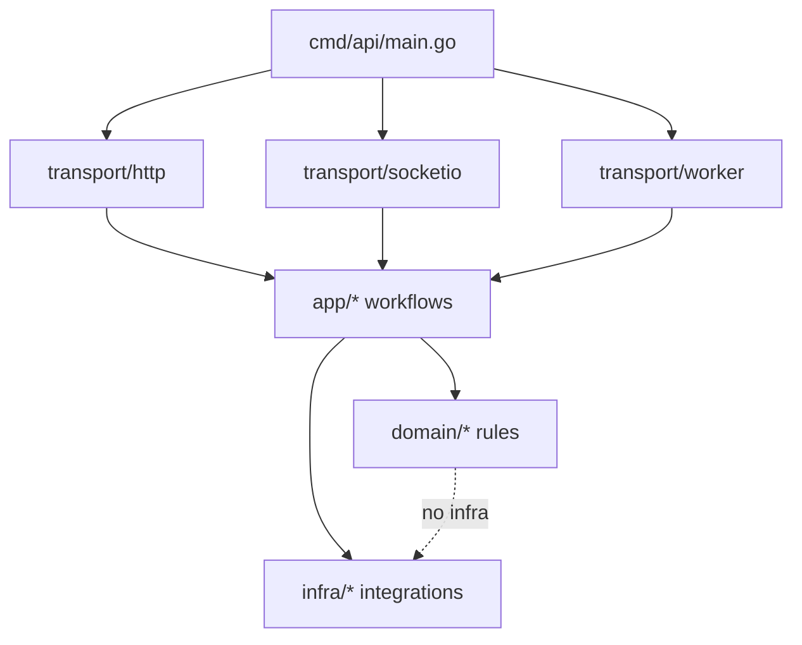

# Linky API — modular monolith layout

## Dependency rule

Requests enter **transport**, which calls **app** workflows. **App** loads data via **infra** and applies **domain** rules. **Domain** packages stay free of database and HTTP details.

## Supabase (`infra/supax`)

- Root `supax` package: bridge + shared repositories (`repositories.go`, `bridge.go`, …) plus one file per table/domain (`user_details.go`, `admin_config.go`, `admin_users.go`, `admin_broadcasts.go`, `reports_crud.go`, `admin_generic_table.go`, `user_ids.go`, `push_subscriptions.go`, …).
- Subpackages: `client/`, `rpc/`, `webhook/`, `favorites/`, `streaks/`, `embeddings/`, `reports/`, `codec/`, `postgrest/`
- Root `*_alias.go` files re-export subpackage symbols for backward-compatible imports
- **No `*_extra.go` files.** New DB helpers go in a domain-named file or subpackage.

## HTTP transport (`transport/http`)

- `admin_routes.go` — route wiring only; no handler bodies.
- Admin handlers live in `admin_{domain}.go` files (e.g. `admin_users.go`, `admin_config.go`, `admin_s3.go`, `admin_embeddings.go`, `admin_reports.go`, `admin_broadcasts.go`, `admin_interest_tags.go`, `admin_crud.go`).
- User handlers live in `domain_user.go` (top-level routes + me/level/blocks) and `domain_user_{area}.go` (e.g. `domain_user_details.go`, `domain_user_settings.go`, `domain_user_profile.go`, `domain_user_streak.go`, `domain_user_reports.go`, `domain_user_favorites.go`, `domain_user_call_history.go`).
- **No `*_extra.go` files.** New handlers go in a domain-named file.
