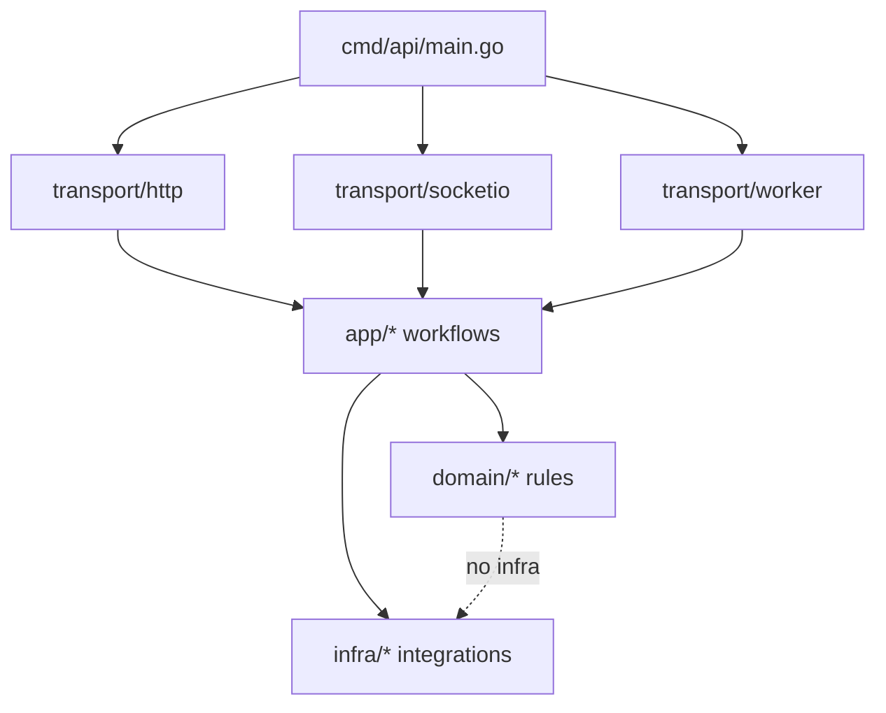

# Linky API — modular monolith layout

## Dependency rule

Requests enter **transport**, which calls **app** workflows. **App** loads data via **infra** and applies **domain** rules. **Domain** packages stay free of database and HTTP details.

## Supabase (`infra/supax`)

- Root `supax` package: bridge + shared repositories (`repositories.go`, `extra.go`, …)
- Subpackages: `client/`, `rpc/`, `webhook/`, `favorites/`, `streaks/`, `embeddings/`, `reports/`, `codec/`, `postgrest/`
- Root `*_alias.go` files re-export subpackage symbols for backward-compatible imports
