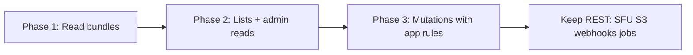

## Current GraphQL

- **Route:** `POST /api/v1/graphql` (Clerk auth required, rate-limited)
- **Engine:** gqlgen in `src/internal/app/graphql/` — single native stack (no Supabase `pg_graphql` proxy)
- **Auth:** Clerk JWT on every request; `users.role` from Supabase (`user` / `admin` / `superadmin`) loaded into request context for field-level checks (`@admin` on `admin` query)
- **Frontend:** no GraphQL client yet — `apps/web` still uses REST
- **REST:** all REST endpoints remain; GraphQL is additive

Resolvers call the same `app/*` and `supax` functions as REST (Clerk-scoped internal user ID, no service-role bypass).

### Tier 1 schema (reads)

| GraphQL | REST equivalent |
|---------|-----------------|
| `viewer { me, details, settings, profile, level, streak, progress, notifications, unreadNotificationCount, callHistory, callHistoryItem, reports }` | `/users/*`, `/notifications/*`, `/call-history`, `/reports` |
| `interestTags`, `interestTag` | `GET /interest-tags` (Clerk required) |
| `admin { reports, report, interestTags, expBonuses, config, configByKey, broadcasts, embeddings }` | `/admin/*` list/get reads |

### Tier 2 schema (reads + mutations) — implemented

| GraphQL | REST equivalent |
|---------|-----------------|
| `viewer { streakCalendar, streakHistory, favorites, blocks }` | `/users/streak/calendar`, `/users/streak/me/history`, `/favorites`, `/users/blocks/me` |
| `mutation.viewer { updateCountry, updateUserDetails, addInterestTags, removeInterestTags, replaceInterestTags, clearInterestTags, addFavorite, removeFavorite, createBlock, deleteBlock, createReport, createCallHistory }` | `/users/me/country`, `/users/details/*`, `/favorites`, `/users/blocks`, `/reports`, `POST /call-history` |
| `admin { users, user, aiConfig, aiModels }` | `GET /admin/users`, `/admin/users/:id`, `/admin/ai/config`, `/admin/ai/models` |
| `mutation.admin { patchUser, softDeleteUser, patchReport, enqueueReportAiSummary, regenerateEmbeddings, syncEmbeddings, syncAllEmbeddings, compareEmbeddings, findSimilarEmbeddings, createBroadcast, generateBroadcastAi, updateAiConfig }` | matching `/admin/*` write routes |

Shared logic lives in `app/user`, `app/favorite`, `app/report`, `app/videochat`, and `app/admin` — REST handlers delegate to the same functions as GraphQL resolvers.

Example queries:

```graphql
query StreakAndFavorites {
  viewer {
    streakCalendar(year: 2026, month: 5)
    favorites
    blocks
  }
}

mutation CreateReport {
  viewer {
    createReport(reportedUserId: "...", reason: "harassment", description: "...")
  }
}

query AdminUsers {
  admin {
    users(page: 1, limit: 50, deleted: false)
  }
}
```

Generate after schema changes:

```bash
cd apps/api/src/internal/app/graphql
go generate
```

### Interest tag catalog auth

`GET /api/v1/interest-tags` and `/:id` require Clerk (same group as other `/api/v1` routes). Previously public.

---

## Full REST surface (~90 endpoints)

### Public (no Clerk)

| Prefix | Methods | Purpose |
|--------|---------|---------|
| `GET /healthz`, `/readyz`, `/`, `/api` | Health / meta |
| `GET /api/v1/interest-tags`, `/:id` | Interest tag catalog (Clerk) |
| `GET /api/v1/matchmaking/queue-status` | Matchmaking queue size estimate |
| `POST /webhook/clerk` | Clerk webhook (Svix) |

### Authenticated `/api/v1` (Clerk)

**Users**

| Endpoint | Methods |
|----------|---------|
| `/users/me` | GET |
| `/users/me/country` | PATCH |
| `/users/timezone` | PATCH |
| `/users/level/me` | GET |
| `/users/streak/me` | GET |
| `/users/streak/me/history` | GET |
| `/users/streak/calendar` | GET |
| `/users/progress/me` | GET |
| `/users/blocks/me` | GET |
| `/users/blocks` | POST |
| `/users/blocks/:blocked_user_id` | DELETE |
| `/users/details/me` | GET, PUT, PATCH |
| `/users/details/me/interest-tags` | POST, DELETE, PUT |
| `/users/details/me/interest-tags/all` | DELETE |
| `/users/settings/me` | GET, PUT, PATCH |
| `/users/profile/me` | GET (aggregate) |

**Resources**

| Endpoint | Methods |
|----------|---------|
| `/call-history`, `/:id` | GET, POST |
| `/favorites`, `/:favorite_user_id` | GET, POST, DELETE |
| `/reports`, `/reports/me` | GET, POST |
| `/notifications/me`, `/me/unread-count` | GET |
| `/notifications/:id/read`, `/read-all` | PATCH |

**Video / realtime**

| Endpoint | Methods |
|----------|---------|
| `/video-chat/end-call-unload` | POST |
| `/video-chat/realtime/session`, `publish`, `subscribe`, `renegotiate`, `cleanup` | POST/PUT |

**Uploads / push**

| Endpoint | Methods |
|----------|---------|
| `/me/s3/*` (presign, multipart) | POST |
| `/push/subscribe`, `unsubscribe`, `vapid-public-key` | POST, DELETE, GET |

**GraphQL**

| Endpoint | Methods |
|----------|---------|
| `/graphql` | POST |

### Admin `/api/v1/admin` (Clerk + admin role)

- **Config:** `/config`, `/config/:key` — full CRUD
- **AI:** `/ai/config`, `/ai/models`
- **Users (DB):** list/get/patch/put/batch delete/soft delete
- **Clerk users:** list/get/patch/put/delete/batch + password compromised flags
- **CRUD tables:** `/interest-tags`, `/exp-bonuses` (+ import, hard delete)
- **Broadcasts:** list, create, AI generate
- **Embeddings:** list, regenerate, sync, sync-all, compare, similar
- **S3:** presign, list, delete, multipart (many routes)
- **Reports:** list, get, patch, AI summary enqueue

Realtime matchmaking itself is **Socket.IO**, not REST — out of scope for GraphQL.

---

## What to migrate (by tier)

### Tier 1 — Strong GraphQL candidates (start here)

These are read-heavy, relational, or classic CRUD. They benefit from **one query** instead of many REST calls, especially on dashboard/profile screens.

| Area | REST endpoints | Why GraphQL fits |
|------|----------------|------------------|
| **User “me” bundle** | `GET /users/me`, `/details/me`, `/settings/me`, `/profile/me`, `/level/me`, `/streak/me`, `/progress/me` | Frontend often needs several of these on load; a single `viewer { me details settings profile level streak progress }` query cuts round-trips |
| **Notifications** | `GET .../me`, `GET .../unread-count` | Natural `notifications { items unreadCount }`; mark-read stays REST or `mutation` later |
| **Call history** | `GET /call-history`, `GET /:id` | Paginated list + optional nested `partner` fields |
| **Reports (user)** | `GET /reports`, `GET /reports/me` | Filtered lists; `createReport` can be a mutation with validation in resolvers |
| **Interest tags (public)** | `GET /interest-tags`, `/:id` | Simple catalog queries; good first **public** schema fields |
| **Admin: reports** | `GET /admin/reports`, `GET /:id` | List + detail with filters (`status`, reporter, reported) |
| **Admin: generic CRUD** | `/admin/interest-tags`, `/admin/exp-bonuses` | Table-shaped; map to `interestTags`, `expBonuses` connections |
| **Admin: broadcasts list** | `GET /admin/broadcasts` | Read path only first |
| **Admin: config list/get** | `GET /admin/config`, `GET /:key` | Reads only; writes need redaction logic in resolvers |
| **Admin: embeddings list** | `GET /admin/embeddings` | Paginated table read |

**Quick win query (native gqlgen):** replace 4–6 parallel REST calls on app boot with one `viewer` query.

---

### Tier 2 — Migrate with native resolvers only (not raw Supabase proxy) — **done**

These hit **app/domain logic**, side effects, or computed fields. Supabase `pg_graphql` alone will not match REST behavior or auth.

| Area | REST | Blockers for proxy-only |
|------|------|-------------------------|
| **Level / streak / progress** | `/users/level/me`, streak*, `/progress/me` | Uses `user.GetUserLevelData`, streak rules, timezone-aware progress |
| **Streak calendar** | `GET .../streak/calendar` | Adds `isToday` from user timezone |
| **Favorites** | `GET /favorites` | `GetFavoritesWithStats` — not a plain table row |
| **Blocks** | blocks CRUD | Validation (`ErrBlockSelf`, etc.) |
| **User details mutations** | PUT/PATCH details, interest-tags | Bio length, tag replace rules |
| **Favorites mutations** | POST/DELETE | Daily limit, refund-on-same-day delete |
| **Create report** | `POST /reports` | Triggers `report.OnReportCreated` job hook |
| **Create call history** | `POST /call-history` | App/videochat rules |
| **Admin user list** | `GET /admin/users` | Merges presence, computed `level`, redacted embedding metadata |
| **Admin user get/patch** | per-user admin | Same + soft delete semantics |
| **Admin report patch / AI summary** | PATCH, POST ai-summary | Job enqueue, not pure DB |
| **Admin embeddings** | regenerate, sync, compare, similar | Jobs + embedding domain |
| **Admin broadcasts** | create, ai-generate | AI + jobs |
| **Admin AI config** | GET/PUT | Redaction/merge via `aiconfig` |
| **User me country** | PATCH | CF header + clerk sync logic in `user.GetMe` path |

Implemented as **gqlgen resolvers** calling `app/*` helpers — same as REST handlers.

---

### Tier 3 — Keep REST (do not migrate to GraphQL)

| Category | Endpoints | Reason |
|----------|-----------|--------|
| **Webhooks** | `POST /webhook/clerk` | Not client GraphQL; signature verification, idempotency |
| **Health** | `/healthz`, `/readyz` | Ops probes, not schema |
| **Matchmaking queue** | `GET .../queue-status` | Ephemeral in-memory/redis-style signal; tiny payload |
| **Video realtime (SFU)** | `/video-chat/realtime/*` | SDP/session protocol, not resource graph |
| **End call unload** | `POST .../end-call-unload` | Socket-coordinated imperative action + custom rate limit |
| **S3 (user + admin)** | all `/me/s3/*`, `/admin/s3/*` | Presigned URLs, multipart — RPC-style, not graph-shaped |
| **Push** | subscribe/unsubscribe/vapid | Web Push subscription handles |
| **Admin Clerk API** | `/admin/users/clerk/*` | External Clerk REST, not Postgres |
| **Admin batch / import** | batch patch/delete, interest-tags import | Bulk imperative operations |
| **Admin jobs** | embeddings regenerate/sync*, report AI summary | `jobs.Enqueue*` — 202 Accepted semantics |
| **Socket.IO** | `/chat`, `/video-chat`, `/admin` namespaces | Realtime transport stays separate |

---

## Suggested migration order



1. **Phase 1 — `viewer` query** (done)  
   `me`, `details`, `settings`, `profile`, `notifications`, `callHistory` (reads only) on `POST /api/v1/graphql`.

2. **Phase 2 — Catalog + admin reads** (done)  
   Public `interestTags`; admin `reports`, `interestTags`, `expBonuses`, `config`, `broadcasts`, `embeddings` (list).

3. **Phase 3 — Mutations** (Tier 2 done; remaining Tier 3)  
   Tier 2: `updateUserDetails`, favorites/blocks, `createReport`, `createCallHistory`, admin user/report/embedding/broadcast/aiConfig mutations.  
   Still REST-only: `updateSettings`, `markNotificationRead`, admin Clerk API, S3, webhooks, batch ops.

4. **Never (or only if you add a separate “admin GraphQL” with strict field policies)**  
   S3, Clerk admin, webhooks, realtime, job triggers.

---

## Architecture note

GraphQL is **gqlgen-only** under `app/graphql`. Extend the schema and resolvers for new features; use `app/*` / `supax` (same as REST). Clerk auth + `users.role` from Supabase gate access — do not add a separate Supabase `pg_graphql` proxy path.

---

## Endpoint count summary

| Bucket | ~Count | GraphQL? |
|--------|--------|----------|
| Public reads | 4 | Yes (interest tags, maybe queue-status stays REST) |
| User reads | 15 | **Yes** (high value) |
| User writes | 20 | Partial (mutations in Phase 3) |
| Notifications | 4 | Reads yes; patches optional |
| Video/realtime | 6 | **No** |
| S3 + push | 8 | **No** |
| Admin reads | ~25 | **Yes** (admin schema) |
| Admin writes/jobs | ~35 | Mostly **no** or thin mutations wrapping jobs |
| Webhook/health | 5 | **No** |
