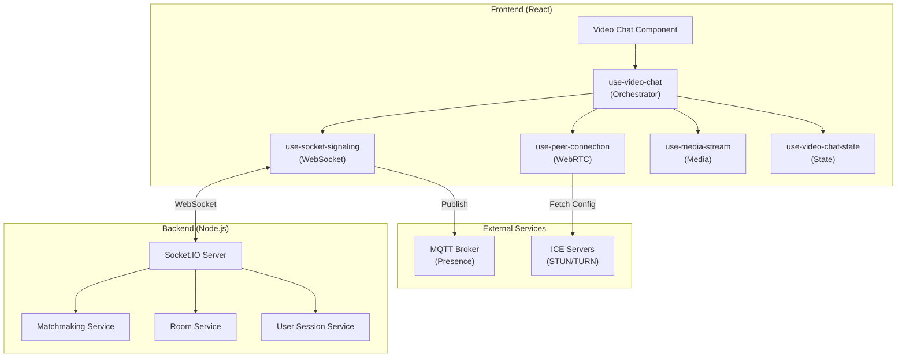
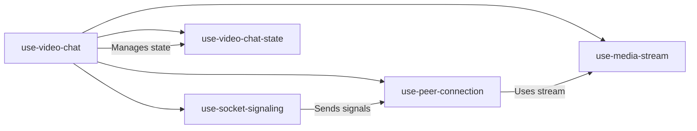
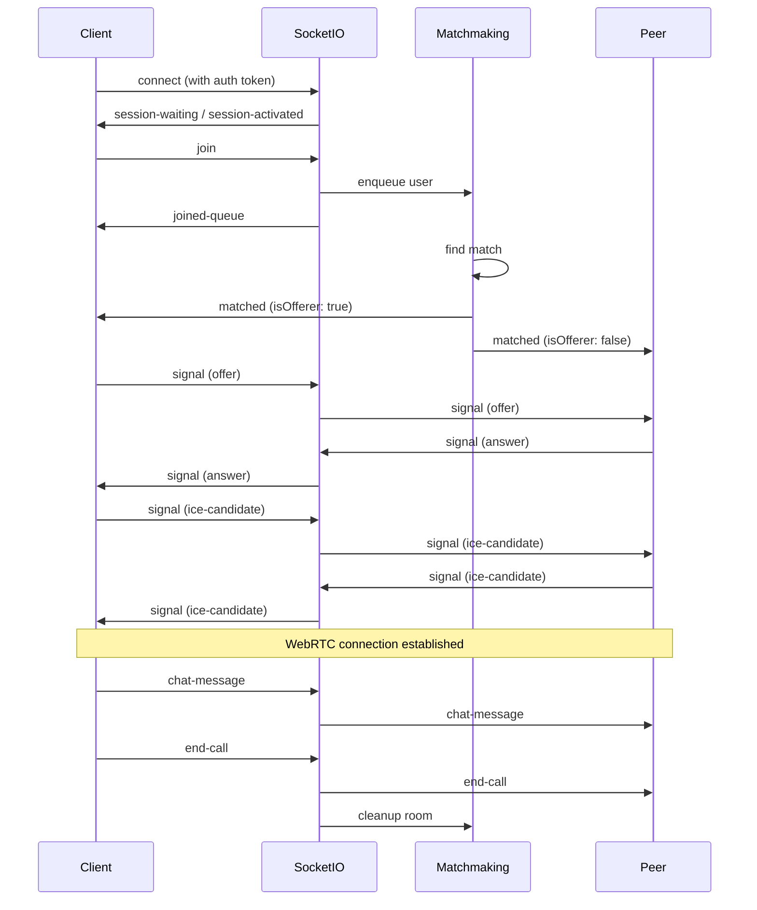
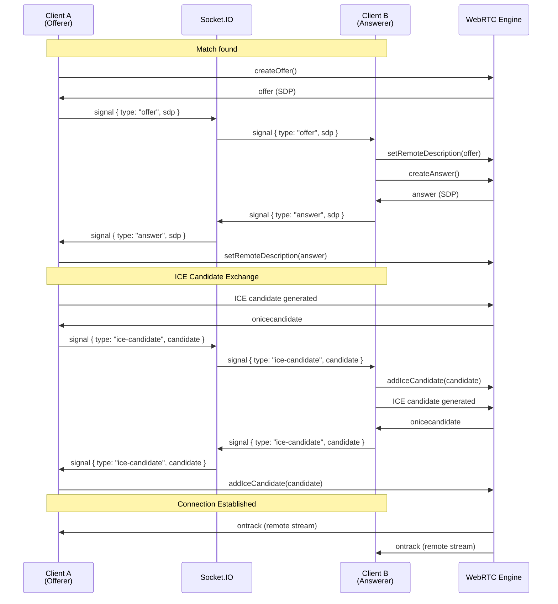
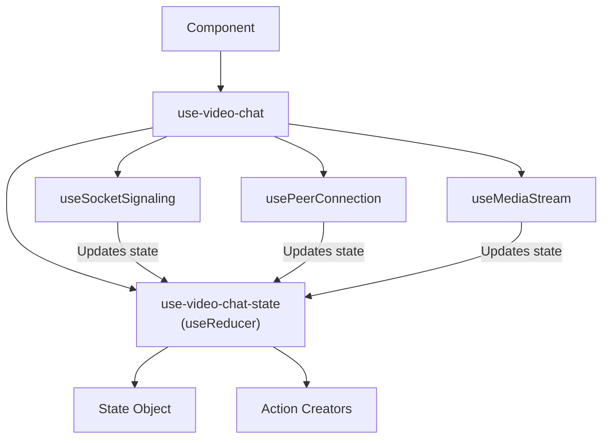
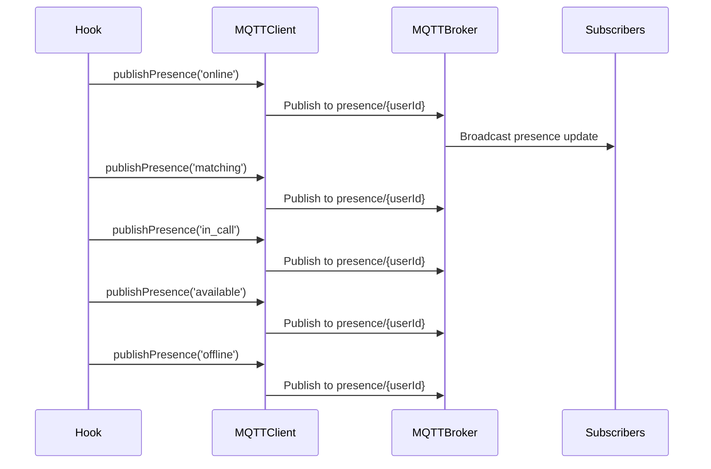
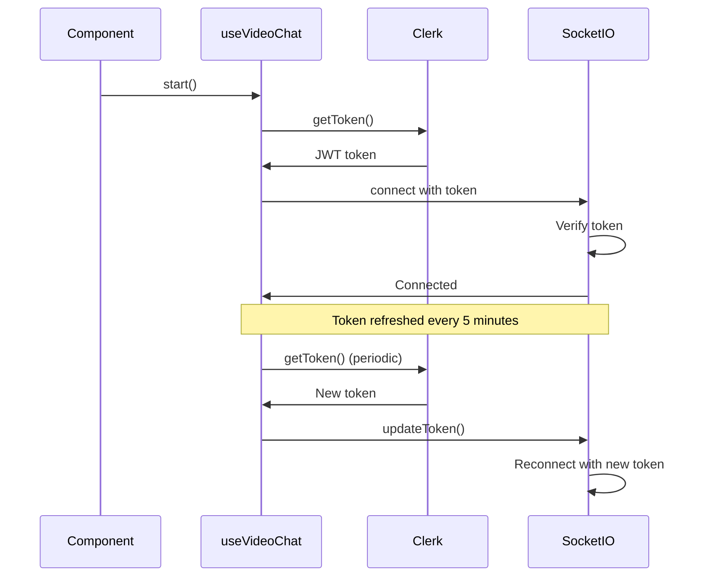

# Video Chat Architecture

This document provides a comprehensive overview of the video chat system architecture, including hook relationships, WebSocket communication flows, and integration patterns.

## System Overview

The video chat system is built on a client-server architecture using:
- **Frontend**: React hooks managing WebRTC connections and WebSocket signaling
- **Backend**: Node.js/Express with Socket.IO for real-time communication
- **WebRTC**: Peer-to-peer video/audio communication
- **MQTT**: Presence status broadcasting

## Architecture Diagram



## Hook Dependency Relationships



## WebSocket Communication Flow

### Connection Lifecycle



### WebSocket Events

#### Client → Server Events

| Event | Description | Payload |
|-------|-------------|---------|
| `join` | Join matchmaking queue | None |
| `skip` | Skip current peer | None |
| `signal` | WebRTC signaling data | `{ type, sdp?, candidate? }` |
| `chat-message` | Send chat message | `{ message, timestamp }` |
| `mute-toggle` | Toggle mute state | `{ muted: boolean }` |
| `end-call` | End current call | None |

#### Server → Client Events

| Event | Description | Payload |
|-------|-------------|---------|
| `session-waiting` | Session queued | `{ message, positionInQueue, queueSize }` |
| `session-activated` | Session activated | `{ message }` |
| `joined-queue` | Successfully joined queue | `{ message, queueSize }` |
| `matched` | Peer matched | `{ roomId, peerId, isOfferer }` |
| `signal` | WebRTC signaling data | `{ type, sdp?, candidate? }` |
| `peer-left` | Peer disconnected | `{ message, queueSize? }` |
| `peer-skipped` | Peer skipped | `{ message, queueSize }` |
| `skipped` | You skipped peer | `{ message, queueSize }` |
| `end-call` | Call ended | `{ message }` |
| `chat-message` | Chat message received | `{ message, timestamp, senderId, senderName?, senderImageUrl? }` |
| `mute-toggle` | Peer mute state changed | `{ muted: boolean }` |
| `queue-timeout` | Queue timeout | `{ message }` |
| `error` | Error occurred | `{ message }` |

## WebRTC Signaling Flow



## Video Chat Lifecycle

```mermaid
stateDiagram-v2
    [*] --> idle: Initial state
    
    idle --> searching: start() called
    searching --> connecting: matched event
    connecting --> connected: WebRTC connection established
    connecting --> peer-disconnected: Connection failed
    connected --> searching: peer-left / peer-skipped
    connected --> idle: end-call
    searching --> idle: queue-timeout / error
    peer-disconnected --> idle: Cleanup
    
    note right of searching
        Waiting in matchmaking queue
    end note
    
    note right of connecting
        Exchanging WebRTC offers/answers
        and ICE candidates
    end note
    
    note right of connected
        Active video/audio call
        Chat messages enabled
    end note
```

## State Management Pattern

The system uses a centralized state management approach:



### State Structure

```typescript
interface VideoChatState {
  localStream: MediaStream | null;
  remoteStream: MediaStream | null;
  isMuted: boolean;
  isVideoOff: boolean;
  remoteMuted: boolean;
  connectionStatus: ConnectionStatus;
  chatMessages: ChatMessage[];
  error: string | null;
}
```

## MQTT Presence Integration

The system publishes presence status to an MQTT broker for real-time user status tracking:



### Presence States

- `online`: Socket connected, user available
- `matching`: User in matchmaking queue
- `in_call`: User in active video call
- `available`: User available but not in queue
- `offline`: Socket disconnected

## Authentication Flow



## Error Handling Strategy

The system implements multiple layers of error handling:

1. **WebSocket Level**: Connection errors, reconnection attempts
2. **WebRTC Level**: ICE connection failures, peer disconnections
3. **State Level**: Error messages stored in state, displayed to user
4. **User Level**: Toast notifications for critical errors

## Performance Considerations

- **ICE Server Pooling**: Pre-fetched and cached ICE servers
- **Token Refresh**: Automatic token refresh every 5 minutes
- **Resource Cleanup**: Proper cleanup of media streams and peer connections
- **State Optimization**: useReducer to minimize re-renders
- **Memoization**: Callbacks and return values memoized

## Security Considerations

- **JWT Authentication**: All WebSocket connections require valid JWT tokens
- **Token Refresh**: Tokens automatically refreshed to prevent expiration
- **Session Management**: Backend enforces single active session per user
- **Room Isolation**: Users can only communicate within matched rooms
- **Signal Validation**: Backend validates all signaling data before relay
