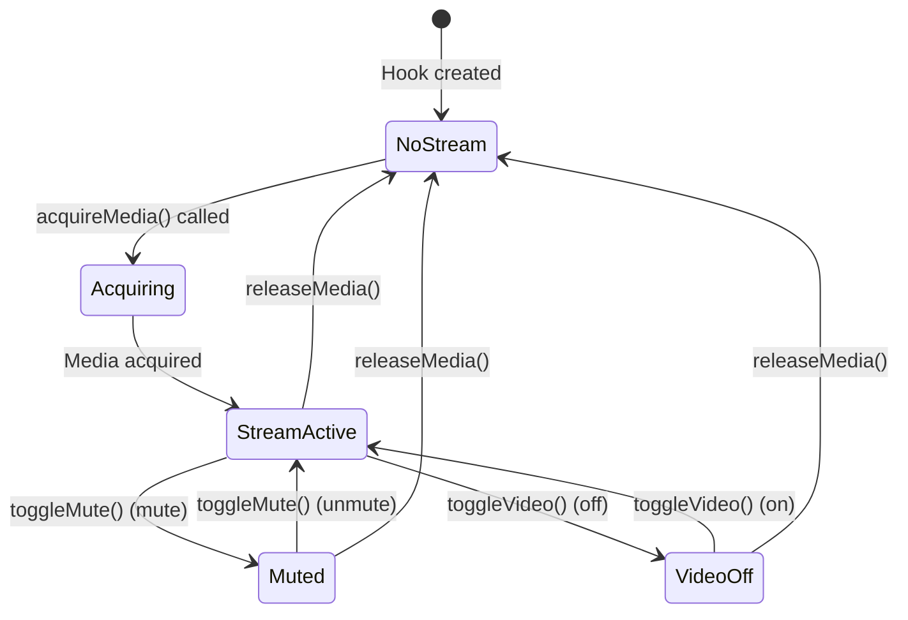

# use-media-stream

## Overview

`use-media-stream` is a React hook that manages local media streams (camera and microphone). It provides a clean interface for acquiring, controlling, and releasing user media resources.

## Purpose

This hook provides:
- Media stream acquisition (camera + microphone)
- Audio mute/unmute control
- Video on/off control
- Track state persistence across stream re-acquisition
- Proper resource cleanup

## Architecture

The hook uses React refs to maintain the media stream instance and track states, ensuring stable references and state persistence.

### Core Structure

```typescript
export function useMediaStream() {
  const streamRef = useRef<MediaStream | null>(null);
  const isMutedRef = useRef(false);
  const isVideoOffRef = useRef(false);
  
  // ... implementation
}
```

### Key Components

1. **Stream Reference**: Maintains the MediaStream instance
2. **Mute State Reference**: Tracks audio mute state
3. **Video State Reference**: Tracks video on/off state

## Backend Interaction

This hook has **no direct backend interaction**. It is purely client-side, managing browser media APIs.

## Frontend Integration

### Usage Pattern

```typescript
import { useMediaStream } from '@/hooks/use-media-stream';

function MyComponent() {
  const mediaStream = useMediaStream();
  
  const startVideo = async () => {
    const stream = await mediaStream.acquireMedia();
    // Use stream for video element or peer connection
  };
  
  const toggleMute = () => {
    const isMuted = mediaStream.toggleMute();
    // Update UI based on mute state
  };
}
```

### Integration with use-video-chat

The hook is used by `use-video-chat` to manage local media:

```typescript
const mediaStream = useMediaStream();

// Acquire media when starting video chat
const stream = await mediaStream.acquireMedia();
actions.setLocalStream(stream);

// Toggle mute
const toggleMute = useCallback(() => {
  const newMutedState = mediaStream.toggleMute();
  actions.setMuted(newMutedState);
  socketSignaling.sendMuteToggle(newMutedState);
}, [mediaStream, socketSignaling]);

// Toggle video
const toggleVideo = useCallback(() => {
  const newVideoOffState = mediaStream.toggleVideo();
  actions.setVideoOff(newVideoOffState);
}, [mediaStream]);
```

## Key Functions

### `acquireMedia()`

Acquires user media (camera + microphone) from the browser.

**Returns:** Promise<MediaStream>

**Behavior:**
- Requests media with optimal settings (1280x720 video, echo cancellation)
- Releases existing stream if present
- Applies saved mute/video states to new stream
- Returns MediaStream instance

**Code Flow:**
```typescript
async function acquireMedia(): Promise<MediaStream> {
  // Cleanup existing stream
  if (streamRef.current) {
    stopMediaStream(streamRef.current);
  }
  
  // Request new media
  const stream = await getUserMedia(true, true);
  streamRef.current = stream;
  
  // Apply saved states
  if (isMutedRef.current) {
    stream.getAudioTracks().forEach((track) => {
      track.enabled = false;
    });
  }
  
  if (isVideoOffRef.current) {
    stream.getVideoTracks().forEach((track) => {
      track.enabled = false;
    });
  }
  
  return stream;
}
```

**Media Constraints:**
- Video: 1280x720 ideal resolution
- Audio: Echo cancellation and noise suppression enabled

### `toggleMute()`

Toggles audio mute state.

**Returns:** boolean (new mute state)

**Behavior:**
- Toggles mute state
- Enables/disables all audio tracks
- Returns new mute state
- Persists state for future stream acquisitions

**Code Flow:**
```typescript
function toggleMute(): boolean {
  if (!streamRef.current) return isMutedRef.current;
  
  const newMutedState = !isMutedRef.current;
  streamRef.current.getAudioTracks().forEach((track) => {
    track.enabled = !newMutedState;
  });
  isMutedRef.current = newMutedState;
  
  return newMutedState;
}
```

**Usage:**
```typescript
const isMuted = mediaStream.toggleMute();
// isMuted: true if muted, false if unmuted
```

### `toggleVideo()`

Toggles video on/off state.

**Returns:** boolean (new video off state)

**Behavior:**
- Toggles video state
- Enables/disables all video tracks
- Returns new video off state
- Persists state for future stream acquisitions

**Code Flow:**
```typescript
function toggleVideo(): boolean {
  if (!streamRef.current) return isVideoOffRef.current;
  
  const newVideoOffState = !isVideoOffRef.current;
  streamRef.current.getVideoTracks().forEach((track) => {
    track.enabled = !newVideoOffState;
  });
  isVideoOffRef.current = newVideoOffState;
  
  return newVideoOffState;
}
```

**Usage:**
```typescript
const isVideoOff = mediaStream.toggleVideo();
// isVideoOff: true if video off, false if video on
```

### `getStream()`

Gets current media stream.

**Returns:** MediaStream | null

**Behavior:**
- Returns current stream reference
- Returns null if no stream acquired

**Usage:**
```typescript
const stream = mediaStream.getStream();
if (stream) {
  // Use stream
}
```

### `releaseMedia()`

Releases all media resources.

**Behavior:**
- Stops all tracks in current stream
- Clears stream reference
- Resets mute and video states

**Code Flow:**
```typescript
function releaseMedia() {
  stopMediaStream(streamRef.current);
  streamRef.current = null;
  isMutedRef.current = false;
  isVideoOffRef.current = false;
}
```

**Usage:**
```typescript
mediaStream.releaseMedia();
```

## Media Stream Lifecycle



## Track Management

### Audio Tracks

Audio tracks are controlled via the `enabled` property:

```typescript
stream.getAudioTracks().forEach((track) => {
  track.enabled = !isMuted; // false = muted, true = unmuted
});
```

### Video Tracks

Video tracks are controlled via the `enabled` property:

```typescript
stream.getVideoTracks().forEach((track) => {
  track.enabled = !isVideoOff; // false = off, true = on
});
```

### Track State Persistence

The hook maintains mute/video states in refs, so when a new stream is acquired, the states are automatically applied:

```typescript
// User mutes
mediaStream.toggleMute(); // isMutedRef.current = true

// Stream is released and re-acquired
mediaStream.releaseMedia();
const newStream = await mediaStream.acquireMedia();
// Audio tracks are automatically muted because isMutedRef.current = true
```

## Media Constraints

The hook uses optimized media constraints:

```typescript
{
  video: {
    width: { ideal: 1280 },
    height: { ideal: 720 }
  },
  audio: {
    echoCancellation: true,
    noiseSuppression: true
  }
}
```

### Video Constraints

- **Resolution**: 1280x720 (ideal)
- **Frame Rate**: Browser default
- **Codec**: Browser default

### Audio Constraints

- **Echo Cancellation**: Enabled
- **Noise Suppression**: Enabled
- **Auto Gain Control**: Browser default

## Resource Cleanup

### Automatic Cleanup

The hook automatically cleans up on unmount:

```typescript
useEffect(() => {
  return () => {
    releaseMedia();
  };
}, [releaseMedia]);
```

### Manual Cleanup

You can manually release media:

```typescript
mediaStream.releaseMedia();
```

### Track Stopping

When releasing media, all tracks are stopped:

```typescript
function stopMediaStream(stream: MediaStream | null) {
  if (stream) {
    stream.getTracks().forEach((track) => {
      track.stop();
    });
  }
}
```

## Error Handling

### Media Acquisition Errors

Media acquisition can fail due to:
- User denying permission
- No camera/microphone available
- Device in use by another application

Errors are handled by the calling code:

```typescript
try {
  const stream = await mediaStream.acquireMedia();
} catch (error) {
  // Handle error (permission denied, device unavailable, etc.)
  console.error("Failed to acquire media:", error);
}
```

### Track Control Errors

Track control operations are safe - they check for stream existence:

```typescript
function toggleMute(): boolean {
  if (!streamRef.current) return isMutedRef.current;
  // Safe to proceed
}
```

## Dependencies

- `@/lib/webrtc`: `getUserMedia` and `stopMediaStream` utilities
- Browser Media APIs: `navigator.mediaDevices.getUserMedia`

## Return Value

```typescript
interface UseMediaStreamReturn {
  acquireMedia: () => Promise<MediaStream>;
  toggleMute: () => boolean;
  toggleVideo: () => boolean;
  getStream: () => MediaStream | null;
  releaseMedia: () => void;
  streamRef: MutableRefObject<MediaStream | null>;
  isMutedRef: MutableRefObject<boolean>;
  isVideoOffRef: MutableRefObject<boolean>;
}
```

## Best Practices

1. **Acquire Once**: Acquire media when needed, reuse the stream
2. **Release Properly**: Always release media when done
3. **Handle Permissions**: Handle permission denied errors gracefully
4. **State Persistence**: The hook maintains state, so you don't need to track it separately
5. **Track Control**: Use toggle functions rather than directly manipulating tracks

## Common Patterns

### Acquiring Media

```typescript
const mediaStream = useMediaStream();

useEffect(() => {
  const start = async () => {
    try {
      const stream = await mediaStream.acquireMedia();
      // Use stream
    } catch (error) {
      console.error("Failed to acquire media:", error);
    }
  };
  
  start();
  
  return () => {
    mediaStream.releaseMedia();
  };
}, []);
```

### Using Stream with Video Element

```typescript
const videoRef = useRef<HTMLVideoElement>(null);
const mediaStream = useMediaStream();

useEffect(() => {
  const setupVideo = async () => {
    const stream = await mediaStream.acquireMedia();
    if (videoRef.current) {
      videoRef.current.srcObject = stream;
    }
  };
  
  setupVideo();
  
  return () => {
    mediaStream.releaseMedia();
  };
}, []);
```

### Using Stream with Peer Connection

```typescript
const mediaStream = useMediaStream();
const peerConnection = usePeerConnection(iceServers);

const startCall = async () => {
  const stream = await mediaStream.acquireMedia();
  peerConnection.initializePeerConnection(stream, callbacks);
};
```

### Mute/Unmute Control

```typescript
const mediaStream = useMediaStream();

const handleMuteClick = () => {
  const isMuted = mediaStream.toggleMute();
  // Update UI
  setMuteButtonText(isMuted ? "Unmute" : "Mute");
};
```

### Video On/Off Control

```typescript
const mediaStream = useMediaStream();

const handleVideoClick = () => {
  const isVideoOff = mediaStream.toggleVideo();
  // Update UI
  setVideoButtonText(isVideoOff ? "Turn On" : "Turn Off");
};
```

## Integration with Peer Connection

When using with peer connection, tracks are added to the connection:

```typescript
const stream = await mediaStream.acquireMedia();
peerConnection.initializePeerConnection(stream, callbacks);

// Tracks are automatically added to peer connection
// When you toggle mute/video, tracks are updated in real-time
// The peer connection reflects the changes
```

## State Management

The hook maintains internal state via refs:

- **streamRef**: Current MediaStream instance
- **isMutedRef**: Current mute state
- **isVideoOffRef**: Current video off state

This state persists across re-renders and stream re-acquisition.

## Troubleshooting

### Media Not Acquiring

1. Check browser permissions
2. Verify camera/microphone are available
3. Check if device is in use
4. Verify HTTPS (required for getUserMedia)

### Tracks Not Working

1. Verify stream is acquired
2. Check track enabled state
3. Verify track is added to peer connection
4. Check browser console for errors

### State Not Persisting

The hook uses refs, so state persists automatically. If you're experiencing issues:
1. Don't create new hook instances
2. Use the same hook instance throughout component lifecycle
3. Check that you're calling methods on the correct instance
