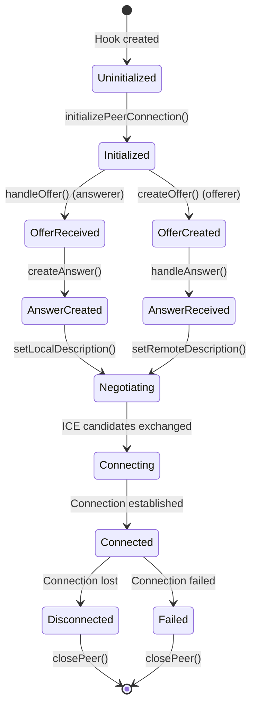

# use-peer-connection

## Overview

`use-peer-connection` is a React hook that manages WebRTC peer connections. It wraps the browser's `RTCPeerConnection` API to provide a clean interface for establishing peer-to-peer video/audio connections.

## Purpose

This hook provides:
- WebRTC peer connection lifecycle management
- Offer/Answer SDP exchange handling
- ICE candidate management
- Track (audio/video) handling
- Connection state monitoring
- Proper resource cleanup

## Architecture

The hook uses React refs to maintain the peer connection instance and callbacks, ensuring stable references across re-renders.

### Core Structure

```typescript
export function usePeerConnection(iceServers: RTCIceServer[]) {
  const pcRef = useRef<RTCPeerConnection | null>(null);
  const callbacksRef = useRef<PeerConnectionCallbacks | null>(null);
  
  // ... implementation
}
```

### Key Components

1. **Peer Connection Reference**: Maintains the RTCPeerConnection instance
2. **Callbacks Reference**: Stores callback functions for WebRTC events
3. **ICE Servers**: STUN/TURN server configuration for NAT traversal

## Backend Interaction

The hook does **not** directly interact with the backend. Instead, it receives signaling data (offers, answers, ICE candidates) through WebSocket events handled by `use-socket-signaling`.

### Signaling Flow

```mermaid
sequenceDiagram
    participant Hook
    participant WebRTC as RTCPeerConnection
    participant SocketIO
    participant Backend
    participant Peer

    Note over Hook,Peer: Offer/Answer Exchange
    Hook->>WebRTC: createOffer()
    WebRTC->>Hook: offer (SDP)
    Hook->>SocketIO: sendSignal({ type: "offer", sdp })
    SocketIO->>Backend: signal event
    Backend->>Peer: signal event
    Peer->>Peer: handleOffer(offer)
    Peer->>Peer: createAnswer()
    Peer->>SocketIO: sendSignal({ type: "answer", sdp })
    SocketIO->>Backend: signal event
    Backend->>Hook: signal event
    Hook->>WebRTC: handleAnswer(answer)
    
    Note over Hook,Peer: ICE Candidate Exchange
    WebRTC->>Hook: onicecandidate
    Hook->>SocketIO: sendSignal({ type: "ice-candidate", candidate })
    SocketIO->>Backend: signal event
    Backend->>Peer: signal event
    Peer->>Peer: addIceCandidate(candidate)
    
    Peer->>Peer: onicecandidate
    Peer->>SocketIO: sendSignal({ type: "ice-candidate", candidate })
    SocketIO->>Backend: signal event
    Backend->>Hook: signal event
    Hook->>WebRTC: addIceCandidate(candidate)
```



## Frontend Integration

### Usage Pattern

```typescript
import { usePeerConnection } from '@/hooks/use-peer-connection';

function MyComponent() {
  const iceServers = [{ urls: 'stun:stun.l.google.com:19302' }];
  const peerConnection = usePeerConnection(iceServers);
  
  const callbacks = {
    onTrack: (stream) => {
      console.log('Received remote stream:', stream);
    },
    onIceCandidate: (candidate) => {
      // Send to peer via WebSocket
    },
    // ... other callbacks
  };
  
  const localStream = await getUserMedia();
  peerConnection.initializePeerConnection(localStream, callbacks);
}
```

### Integration with use-video-chat

The hook is used by `use-video-chat` which orchestrates the entire flow:

```typescript
const peerCallbacks = useMemo(() => ({
  onTrack: (stream) => {
    actions.setRemoteStream(stream);
    actions.setConnectionStatus("connected");
  },
  onIceCandidate: (candidate) => {
    socketSignaling.sendSignal({
      type: "ice-candidate",
      candidate: candidate.toJSON(),
    });
  },
  onConnectionStateChange: (state) => {
    if (state === "disconnected" || state === "failed") {
      actions.setConnectionStatus("peer-disconnected");
    }
  },
  // ... other callbacks
}), [socketSignaling, actions]);

peerConnection.initializePeerConnection(localStream, peerCallbacks);
```

## Key Functions

### `initializePeerConnection(localStream, callbacks)`

Initializes a new RTCPeerConnection and sets up event handlers.

**Parameters:**
- `localStream`: MediaStream from user's camera/microphone
- `callbacks`: Object with WebRTC event handlers

**Behavior:**
- Closes existing connection if present
- Creates new RTCPeerConnection with ICE servers
- Adds all tracks from local stream
- Sets up event handlers (ontrack, onicecandidate, etc.)
- Returns the peer connection instance

**Code Flow:**
```typescript
function initializePeerConnection(localStream, callbacks) {
  // Cleanup existing connection
  if (pcRef.current) {
    closePeerConnection(pcRef.current);
  }
  
  // Create new connection
  const pc = createPeerConnection(iceServers);
  pcRef.current = pc;
  callbacksRef.current = callbacks;
  
  // Add local tracks
  localStream.getTracks().forEach((track) => {
    pc.addTrack(track, localStream);
  });
  
  // Setup event handlers
  pc.ontrack = (event) => {
    const [remoteStream] = event.streams;
    if (remoteStream && callbacksRef.current) {
      callbacksRef.current.onTrack(remoteStream);
    }
  };
  
  pc.onicecandidate = (event) => {
    if (event.candidate && callbacksRef.current) {
      callbacksRef.current.onIceCandidate(event.candidate);
    }
  };
  
  // ... other handlers
  
  return pc;
}
```

### `createOffer()`

Creates a WebRTC offer (SDP) for initiating connection.

**Returns:** Promise<RTCSessionDescriptionInit>

**Behavior:**
- Creates offer with audio/video enabled
- Sets local description
- Returns offer SDP for signaling

**Usage:**
```typescript
if (isOfferer) {
  const offer = await peerConnection.createOffer();
  socketSignaling.sendSignal({
    type: "offer",
    sdp: offer,
  });
}
```

### `handleOffer(offer)`

Handles incoming offer from peer.

**Parameters:**
- `offer`: RTCSessionDescriptionInit from peer

**Returns:** Promise<RTCSessionDescriptionInit> (answer)

**Behavior:**
- Sets remote description (offer)
- Creates answer
- Sets local description (answer)
- Returns answer SDP for signaling

**Usage:**
```typescript
if (data.type === "offer") {
  const answer = await peerConnection.handleOffer(data.sdp);
  socketSignaling.sendSignal({
    type: "answer",
    sdp: answer,
  });
}
```

### `handleAnswer(answer)`

Handles incoming answer from peer.

**Parameters:**
- `answer`: RTCSessionDescriptionInit from peer

**Returns:** Promise<void>

**Behavior:**
- Sets remote description (answer)
- Completes SDP negotiation

**Usage:**
```typescript
if (data.type === "answer") {
  await peerConnection.handleAnswer(data.sdp);
}
```

### `addIceCandidate(candidate)`

Adds ICE candidate from peer.

**Parameters:**
- `candidate`: RTCIceCandidateInit from peer

**Returns:** Promise<void>

**Behavior:**
- Validates connection state
- Adds candidate to peer connection
- Handles errors gracefully

**Usage:**
```typescript
if (data.type === "ice-candidate" && data.candidate) {
  await peerConnection.addIceCandidate(data.candidate);
}
```

### `isConnectionValid()`

Checks if peer connection is in valid state.

**Returns:** boolean

**Behavior:**
- Checks signaling state (not "closed")
- Checks connection state (not "closed", "failed", "disconnected")
- Returns true if connection is usable

**Usage:**
```typescript
if (!peerConnection.isConnectionValid()) {
  logger.warn("Signal received but peer connection not ready");
  return;
}
```

### `closePeer()`

Closes and cleans up peer connection.

**Behavior:**
- Closes peer connection
- Clears references
- Removes event handlers

**Usage:**
```typescript
peerConnection.closePeer();
```

## WebRTC Event Handlers

### `onTrack`

Fired when remote track is received.

```typescript
pc.ontrack = (event) => {
  const [remoteStream] = event.streams;
  callbacks.onTrack(remoteStream);
};
```

**When:** Remote peer adds track to connection
**Data:** MediaStream with remote audio/video tracks

### `onIceCandidate`

Fired when ICE candidate is generated.

```typescript
pc.onicecandidate = (event) => {
  if (event.candidate) {
    callbacks.onIceCandidate(event.candidate);
  }
};
```

**When:** ICE candidate discovered during NAT traversal
**Data:** RTCIceCandidate to send to peer

### `onConnectionStateChange`

Fired when connection state changes.

```typescript
pc.onconnectionstatechange = () => {
  callbacks.onConnectionStateChange(pc.connectionState);
};
```

**States:**
- `new`: Initial state
- `connecting`: Establishing connection
- `connected`: Connection established
- `disconnected`: Connection lost
- `failed`: Connection failed
- `closed`: Connection closed

### `onIceConnectionStateChange`

Fired when ICE connection state changes.

```typescript
pc.oniceconnectionstatechange = () => {
  callbacks.onIceConnectionStateChange(pc.iceConnectionState);
};
```

**States:**
- `new`: Initial state
- `checking`: Checking candidates
- `connected`: ICE connection established
- `completed`: All candidates checked
- `failed`: ICE connection failed
- `disconnected`: ICE connection lost
- `closed`: ICE connection closed

### `onIceGatheringStateChange`

Fired when ICE gathering state changes.

```typescript
pc.onicegatheringstatechange = () => {
  logger.info("ICE gathering state:", pc.iceGatheringState);
};
```

**States:**
- `new`: Initial state
- `gathering`: Gathering candidates
- `complete`: Gathering complete

## Connection Lifecycle



## WebRTC Signaling States

### Signaling State Machine

```mermaid
stateDiagram-v2
    [*] --> stable: Connection created
    stable --> have-local-offer: setLocalDescription(offer)
    stable --> have-remote-offer: setRemoteDescription(offer)
    have-local-offer --> stable: setRemoteDescription(answer)
    have-remote-offer --> stable: setLocalDescription(answer)
    stable --> closed: close()
    have-local-offer --> closed: close()
    have-remote-offer --> closed: close()
```

## ICE Server Configuration

ICE servers are fetched from backend API and passed to the hook:

```typescript
// Fetch ICE servers
const iceServers = await fetchIceServers(token);
// [{ urls: 'stun:...' }, { urls: 'turn:...', username: '...', credential: '...' }]

// Initialize hook
const peerConnection = usePeerConnection(iceServers);
```

### ICE Server Structure

```typescript
interface RTCIceServer {
  urls: string | string[];
  username?: string;
  credential?: string;
}
```

## Error Handling

### Connection Validation

Before processing signals, the connection is validated:

```typescript
if (!peerConnection.isConnectionValid()) {
  logger.warn("Signal received but peer connection not ready");
  return;
}
```

### ICE Candidate Errors

ICE candidates are added with error handling:

```typescript
try {
  await pc.addIceCandidate(new RTCIceCandidate(candidate));
} catch (err) {
  if (isConnectionValid()) {
    logger.warn("Failed to add ICE candidate:", err);
  }
}
```

### Connection State Monitoring

Connection states are monitored to detect failures:

```typescript
pc.onconnectionstatechange = () => {
  if (pc.connectionState === "failed" || pc.connectionState === "disconnected") {
    // Handle connection failure
    actions.setConnectionStatus("peer-disconnected");
  }
};
```

## Resource Management

### Track Management

Local tracks are added when connection is initialized:

```typescript
localStream.getTracks().forEach((track) => {
  pc.addTrack(track, localStream);
});
```

### Cleanup

The hook automatically cleans up on unmount:

```typescript
useEffect(() => {
  return () => {
    closePeer();
  };
}, [closePeer]);
```

### Close Process

1. Remove all event handlers
2. Close peer connection
3. Clear references

```typescript
function closePeerConnection(pc: RTCPeerConnection | null) {
  if (pc) {
    pc.ontrack = null;
    pc.onicecandidate = null;
    pc.onconnectionstatechange = null;
    pc.oniceconnectionstatechange = null;
    pc.onicegatheringstatechange = null;
    pc.close();
  }
}
```

## Dependencies

- `@/lib/webrtc`: Peer connection creation and cleanup utilities
- `@/utils/logger`: Logging utilities
- Browser WebRTC APIs: RTCPeerConnection, RTCSessionDescription, RTCIceCandidate

## Return Value

```typescript
interface UsePeerConnectionReturn {
  initializePeerConnection: (localStream: MediaStream, callbacks: PeerConnectionCallbacks) => RTCPeerConnection;
  createOffer: () => Promise<RTCSessionDescriptionInit>;
  handleOffer: (offer: RTCSessionDescriptionInit) => Promise<RTCSessionDescriptionInit>;
  handleAnswer: (answer: RTCSessionDescriptionInit) => Promise<void>;
  addIceCandidate: (candidate: RTCIceCandidateInit) => Promise<void>;
  closePeer: () => void;
  isConnectionValid: () => boolean;
  getPeerConnection: () => RTCPeerConnection | null;
  pcRef: MutableRefObject<RTCPeerConnection | null>;
}
```

## Best Practices

1. **Initialize Once**: Initialize connection when match is found
2. **Validate Before Signaling**: Always check `isConnectionValid()` before processing signals
3. **Handle All States**: Monitor connection and ICE states for failures
4. **Cleanup Properly**: Always close connection when done
5. **Error Handling**: Handle errors gracefully, especially ICE candidate errors

## Common Patterns

### Offerer Flow

```typescript
// Initialize connection
peerConnection.initializePeerConnection(localStream, callbacks);

// Create and send offer
const offer = await peerConnection.createOffer();
socketSignaling.sendSignal({ type: "offer", sdp: offer });

// Wait for answer
// (handled in onSignal callback)

// Handle answer
await peerConnection.handleAnswer(answer);
```

### Answerer Flow

```typescript
// Initialize connection
peerConnection.initializePeerConnection(localStream, callbacks);

// Wait for offer
// (handled in onSignal callback)

// Handle offer and send answer
const answer = await peerConnection.handleOffer(offer);
socketSignaling.sendSignal({ type: "answer", sdp: answer });
```

### ICE Candidate Exchange

```typescript
// Send ICE candidates
pc.onicecandidate = (event) => {
  if (event.candidate) {
    socketSignaling.sendSignal({
      type: "ice-candidate",
      candidate: event.candidate.toJSON(),
    });
  }
};

// Receive ICE candidates
if (data.type === "ice-candidate" && data.candidate) {
  await peerConnection.addIceCandidate(data.candidate);
}
```

## Troubleshooting

### Connection Not Establishing

1. Check ICE servers are valid
2. Verify signaling (offer/answer) exchange
3. Check ICE candidate exchange
4. Monitor connection state changes
5. Check firewall/NAT configuration

### Tracks Not Received

1. Verify local tracks are added
2. Check remote description is set
3. Monitor `ontrack` events
4. Verify connection state is "connected"

### ICE Candidates Not Working

1. Verify STUN/TURN servers are accessible
2. Check candidate format
3. Ensure candidates are added in correct order
4. Monitor ICE connection state
