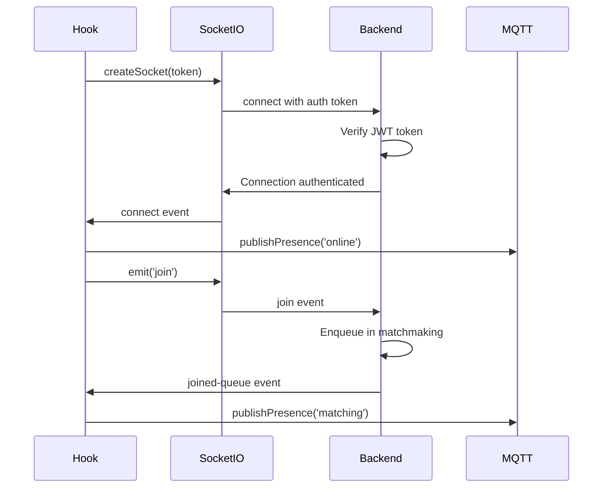
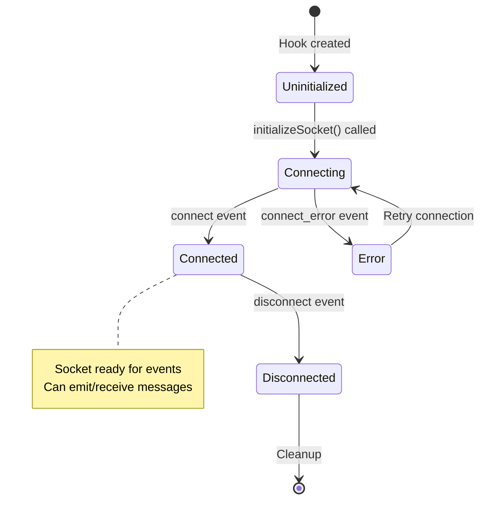
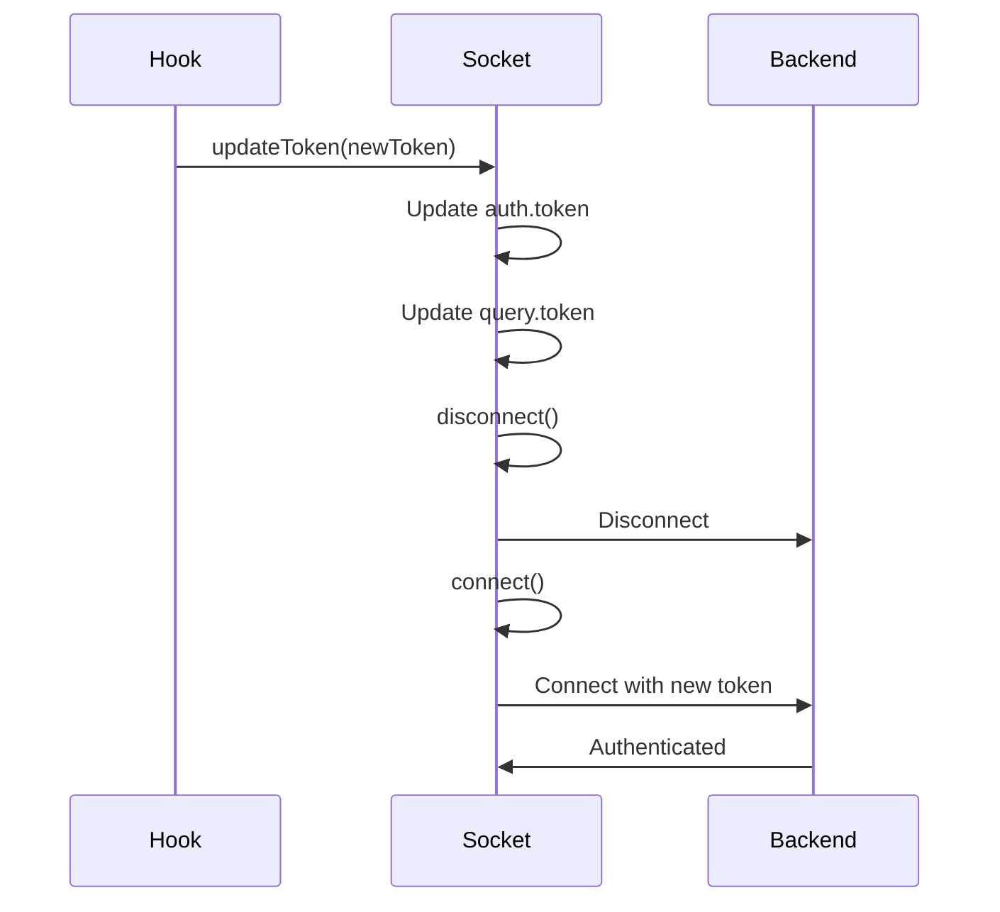

# use-socket-signaling

## Overview

`use-socket-signaling` is a React hook that manages WebSocket connections using Socket.IO. It serves as the communication layer between the frontend and backend for video chat signaling, matchmaking, and real-time messaging.

## Purpose

This hook provides:
- WebSocket connection lifecycle management
- Socket.IO event handling and emission
- Token-based authentication and refresh
- MQTT presence status publishing
- Centralized callback system for all socket events

## Architecture

The hook uses React refs to maintain socket instance and callbacks across re-renders, ensuring stable references and preventing unnecessary re-initializations.

### Core Structure

```typescript
export function useSocketSignaling(): UseSocketSignalingReturn {
  const socketRef = useRef<Socket | null>(null);
  const callbacksRef = useRef<SocketCallbacks | null>(null);
  const currentSocketIdRef = useRef<string | null>(null);
  
  // ... implementation
}
```

### Key Components

1. **Socket Reference**: Maintains the Socket.IO client instance
2. **Callbacks Reference**: Stores callback functions for event handling
3. **Socket ID Reference**: Tracks current socket connection ID

## Backend Interaction

### Connection Flow



### WebSocket Events

#### Events Emitted (Client → Server)

| Event | When | Payload | Handler |
|-------|------|--------|---------|
| `join` | User wants to join matchmaking | None | `joinQueue()` |
| `skip` | User wants to skip current peer | None | `skipPeer()` |
| `signal` | WebRTC signaling data | `SignalData` | `sendSignal()` |
| `chat-message` | User sends chat message | `{ message, timestamp }` | `sendChatMessage()` |
| `mute-toggle` | User toggles mute | `{ muted: boolean }` | `sendMuteToggle()` |
| `end-call` | User ends call | None | `sendEndCall()` |

#### Events Received (Server → Client)

| Event | When | Payload | Callback |
|-------|------|--------|---------|
| `connect` | Socket connected | None | `onConnect()` |
| `disconnect` | Socket disconnected | `reason: string` | `onDisconnect()` |
| `connect_error` | Connection error | `Error` | `onConnectError()` |
| `joined-queue` | Successfully joined queue | `{ message, queueSize }` | `onJoinedQueue()` |
| `matched` | Peer matched | `{ roomId, peerId, isOfferer }` | `onMatched()` |
| `signal` | WebRTC signaling data | `SignalData` | `onSignal()` |
| `peer-left` | Peer disconnected | `{ message, queueSize? }` | `onPeerLeft()` |
| `peer-skipped` | Peer skipped | `{ message, queueSize }` | `onPeerSkipped()` |
| `skipped` | You skipped peer | `{ message, queueSize }` | `onSkipped()` |
| `end-call` | Call ended | `{ message }` | `onEndCall()` |
| `chat-message` | Chat message received | `{ message, timestamp, senderId, senderName?, senderImageUrl? }` | `onChatMessage()` |
| `mute-toggle` | Peer mute state changed | `{ muted: boolean }` | `onMuteToggle()` |
| `queue-timeout` | Queue timeout | `{ message }` | `onQueueTimeout()` |
| `error` | Error occurred | `{ message }` | `onError()` |

### Signal Data Structure

```typescript
export interface SignalData {
  type: "offer" | "answer" | "ice-candidate";
  sdp?: RTCSessionDescriptionInit;  // For offer/answer
  candidate?: RTCIceCandidateInit;  // For ICE candidates
}
```

## Frontend Integration

### Usage Pattern

```typescript
import { useSocketSignaling } from '@/hooks/use-socket-signaling';

function MyComponent() {
  const socketSignaling = useSocketSignaling();
  
  useEffect(() => {
    const callbacks: SocketCallbacks = {
      onConnect: () => console.log('Connected'),
      onMatched: (data) => {
        console.log('Matched with:', data.peerId);
      },
      // ... other callbacks
    };
    
    socketSignaling.initializeSocket(callbacks, token);
  }, []);
}
```

### Integration with use-video-chat

The hook is primarily used by `use-video-chat` which provides all callbacks:

```typescript
const socketCallbacks = useMemo(() => ({
  onConnect: () => {},
  onMatched: async (data) => {
    // Handle match, initialize peer connection
  },
  onSignal: async (data) => {
    // Handle WebRTC signaling
  },
  // ... other callbacks
}), [/* dependencies */]);

await socketSignaling.initializeSocket(socketCallbacks, token);
```

## Key Functions

### `initializeSocket(callbacks, token?)`

Initializes or reuses existing socket connection.

**Behavior:**
- Checks for existing socket connection
- Reuses if connected, otherwise creates new connection
- Registers all event listeners
- Stores callbacks for event handling

**Code Flow:**
```typescript
async function initializeSocket(callbacks, token) {
  if (socketRef.current && socketRef.current.connected) {
    // Reuse existing connection
    socketRef.current.removeAllListeners();
    registerSocketListeners(socketRef.current, callbacks);
    return socketRef.current;
  }
  
  // Create new connection
  const socket = await createSocket(token);
  socketRef.current = socket;
  callbacksRef.current = callbacks;
  registerSocketListeners(socket, callbacks);
  return socket;
}
```

### `updateSocketToken(token)`

Updates authentication token for existing socket connection.

**Behavior:**
- Updates token in socket auth and query params
- If connected, disconnects and reconnects with new token
- Ensures fresh authentication

### `joinQueue()`

Joins the matchmaking queue.

**Behavior:**
- Emits `join` event to server
- Waits for connection if not connected
- Publishes `matching` presence status

### `sendSignal(data)`

Sends WebRTC signaling data to peer.

**Behavior:**
- Emits `signal` event with signaling data
- Backend relays to matched peer
- Used for offer/answer/ICE candidate exchange

### `sendChatMessage(message, timestamp)`

Sends chat message to peer.

**Behavior:**
- Emits `chat-message` event
- Backend adds sender metadata and relays to peer

### `sendMuteToggle(muted)`

Notifies peer of mute state change.

**Behavior:**
- Emits `mute-toggle` event
- Backend relays to peer for UI updates

### `skipPeer()`

Skips current peer and re-enters queue.

**Behavior:**
- Emits `skip` event
- Backend handles room cleanup and re-queuing
- Publishes `matching` presence status

### `sendEndCall()`

Ends current call.

**Behavior:**
- Emits `end-call` event
- Backend notifies peer and cleans up room
- Publishes `available` presence status

## MQTT Presence Integration

The hook automatically publishes presence status to MQTT broker on various events:

| Event | Presence State | When |
|-------|---------------|------|
| `connect` | `online` | Socket connected |
| `disconnect` | `offline` | Socket disconnected |
| `connect_error` | `offline` | Connection error |
| `joined-queue` | `matching` | Joined matchmaking queue |
| `matched` | `in_call` | Peer matched |
| `signal` | `in_call` | Signaling during call |
| `chat-message` | `in_call` | Chat message sent/received |
| `mute-toggle` | `in_call` | Mute toggle during call |
| `peer-left` | `matching` | Peer left, re-entering queue |
| `peer-skipped` | `matching` | Peer skipped, re-entering queue |
| `skipped` | `matching` | You skipped, re-entering queue |
| `end-call` | `available` | Call ended |
| `queue-timeout` | `available` | Queue timeout |
| `error` | `offline` | Error occurred |

## Event Listener Registration

The hook uses `registerSocketListeners` to set up all event handlers:

```typescript
function registerSocketListeners(socket: Socket, callbacks: SocketCallbacks) {
  socket.on("connect", () => {
    currentSocketIdRef.current = socket.id || null;
    publishPresence('online');
    callbacks.onConnect();
  });
  
  socket.on("matched", (data) => {
    publishPresence('in_call');
    callbacks.onMatched(data);
  });
  
  // ... all other event listeners
}
```

## Connection Lifecycle



## Token Management

### Initial Connection

```typescript
const token = await getToken({ template: 'custom', skipCache: true });
await socketSignaling.initializeSocket(callbacks, token);
```

### Token Refresh

Tokens are refreshed periodically (every 5 minutes) in `use-video-chat`:

```typescript
useEffect(() => {
  const updateToken = async () => {
    const token = await getToken({ template: 'custom', skipCache: true });
    if (token) {
      socketSignaling.updateSocketToken(token);
    }
  };
  
  updateToken();
  const interval = setInterval(updateToken, 300_000); // 5 minutes
  
  return () => clearInterval(interval);
}, []);
```

### Token Update Flow



## Error Handling

### Connection Errors

- `connect_error`: Logged and `onConnectError` callback invoked
- Automatic reconnection handled by Socket.IO client
- Presence status set to `offline` on errors

### Socket Errors

- Server-sent `error` events trigger `onError` callback
- Error messages stored in state by consuming hooks
- User notified via toast notifications

## Cleanup

The hook automatically cleans up on unmount:

```typescript
useEffect(() => {
  return () => {
    disconnectSocket();
  };
}, [disconnectSocket]);
```

### Cleanup Process

1. Remove all event listeners
2. Disconnect socket
3. Clear socket reference
4. Clear socket ID reference

## Dependencies

- `@/lib/socket`: Socket.IO client creation and token management
- `@/lib/mqtt/client`: MQTT presence publishing
- `@/utils/logger`: Logging utilities
- `socket.io-client`: Socket.IO client library

## Return Value

```typescript
interface UseSocketSignalingReturn {
  initializeSocket: (callbacks: SocketCallbacks, token?: string) => Promise<Socket>;
  updateSocketToken: (token: string) => void;
  sendSignal: (data: SignalData) => void;
  joinQueue: () => void;
  skipPeer: () => void;
  sendEndCall: () => void;
  sendChatMessage: (message: string, timestamp: number) => void;
  sendMuteToggle: (muted: boolean) => void;
  removeAllListeners: () => void;
  disconnectSocket: () => void;
  getSocket: () => Socket | null;
  getSocketId: () => string | null;
  socketRef: MutableRefObject<Socket | null>;
  currentSocketIdRef: MutableRefObject<string | null>;
}
```

## Best Practices

1. **Initialize Once**: Call `initializeSocket` once per component lifecycle
2. **Provide All Callbacks**: Ensure all required callbacks are provided
3. **Handle Errors**: Always implement error callbacks
4. **Cleanup**: Let the hook handle cleanup automatically via useEffect
5. **Token Management**: Refresh tokens periodically to prevent expiration

## Common Patterns

### Conditional Join

```typescript
if (socketRef.current?.connected) {
  socketSignaling.joinQueue();
} else {
  socketRef.current?.once("connect", () => {
    socketSignaling.joinQueue();
  });
}
```

### Signal Handling

```typescript
socketSignaling.sendSignal({
  type: "offer",
  sdp: offer,
});
```

### Chat Message

```typescript
const timestamp = Date.now();
socketSignaling.sendChatMessage("Hello!", timestamp);
```
