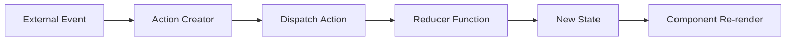

# use-video-chat-state

## Overview

`use-video-chat-state` is a React hook that provides centralized state management for the video chat UI using the `useReducer` pattern. It manages all UI-related state including connection status, media streams, chat messages, and error states.

## Purpose

This hook provides:
- Centralized state management using useReducer
- Type-safe state updates
- Memoized action creators
- Predictable state transitions
- Optimized re-renders

## Architecture

The hook uses React's `useReducer` to manage complex state with predictable updates. All state changes go through action dispatchers, ensuring consistency.

### Core Structure

```typescript
export function useVideoChatState() {
  const [state, dispatch] = useReducer(videoChatReducer, initialState);
  
  const actions = useMemo(() => ({
    setLocalStream: (stream) => dispatch({ type: "SET_LOCAL_STREAM", payload: stream }),
    setRemoteStream: (stream) => dispatch({ type: "SET_REMOTE_STREAM", payload: stream }),
    // ... other actions
  }), []);
  
  return { state, actions };
}
```

### Key Components

1. **Reducer Function**: Handles all state transitions
2. **Initial State**: Default state values
3. **Action Creators**: Memoized functions for state updates
4. **State Object**: Current state values

## Backend Interaction

This hook has **no direct backend interaction**. It is a pure state management hook. State updates are triggered by other hooks that interact with the backend.

## Frontend Integration

### Usage Pattern

```typescript
import { useVideoChatState } from '@/hooks/use-video-chat-state';

function MyComponent() {
  const { state, actions } = useVideoChatState();
  
  // Access state
  const { connectionStatus, localStream, remoteStream } = state;
  
  // Update state
  actions.setConnectionStatus("connected");
  actions.setLocalStream(stream);
}
```

### Integration with use-video-chat

The hook is used by `use-video-chat` which orchestrates state updates:

```typescript
const { state, actions } = useVideoChatState();

// Store actions in ref for stable access
const actionsRef = useRef(actions);
actionsRef.current = actions;

// Update state from various sources
actions.setConnectionStatus("searching");
actions.setLocalStream(stream);
actions.addChatMessage(message);
```

## State Structure

```typescript
interface VideoChatState {
  localStream: MediaStream | null;
  remoteStream: MediaStream | null;
  isMuted: boolean;
  isVideoOff: boolean;
  remoteMuted: boolean;
  connectionStatus: ConnectionStatus;
  chatMessages: ChatMessage[];
  error: string | null;
}
```

### State Properties

| Property | Type | Description |
|----------|------|-------------|
| `localStream` | `MediaStream \| null` | User's local camera/microphone stream |
| `remoteStream` | `MediaStream \| null` | Peer's remote video/audio stream |
| `isMuted` | `boolean` | Local audio mute state |
| `isVideoOff` | `boolean` | Local video off state |
| `remoteMuted` | `boolean` | Remote peer mute state |
| `connectionStatus` | `ConnectionStatus` | Current connection status |
| `chatMessages` | `ChatMessage[]` | Array of chat messages |
| `error` | `string \| null` | Current error message |

### Connection Status Types

```typescript
type ConnectionStatus = 
  | "idle"              // Ready, not searching
  | "searching"          // In matchmaking queue
  | "connecting"         // Matched, establishing WebRTC
  | "connected"          // WebRTC connection established
  | "peer-disconnected"; // Peer disconnected or connection failed
```

### Chat Message Structure

```typescript
interface ChatMessage {
  id: string;
  message: string;
  timestamp: number;
  senderId: string;
  senderName?: string;
  senderImageUrl?: string;
  isOwn: boolean;
}
```

## Actions

All state updates are performed through action creators:

### `setLocalStream(stream)`

Sets the local media stream.

**Parameters:**
- `stream`: `MediaStream | null`

**Action:** `{ type: "SET_LOCAL_STREAM", payload: stream }`

**Usage:**
```typescript
actions.setLocalStream(stream);
```

### `setRemoteStream(stream)`

Sets the remote media stream.

**Parameters:**
- `stream`: `MediaStream | null`

**Action:** `{ type: "SET_REMOTE_STREAM", payload: stream }`

**Usage:**
```typescript
actions.setRemoteStream(stream);
```

### `setConnectionStatus(status)`

Sets the connection status.

**Parameters:**
- `status`: `ConnectionStatus`

**Action:** `{ type: "SET_CONNECTION_STATUS", payload: status }`

**Usage:**
```typescript
actions.setConnectionStatus("connected");
```

### `setMuted(muted)`

Sets the local mute state.

**Parameters:**
- `muted`: `boolean`

**Action:** `{ type: "SET_MUTED", payload: muted }`

**Usage:**
```typescript
actions.setMuted(true);
```

### `setVideoOff(videoOff)`

Sets the local video off state.

**Parameters:**
- `videoOff`: `boolean`

**Action:** `{ type: "SET_VIDEO_OFF", payload: videoOff }`

**Usage:**
```typescript
actions.setVideoOff(true);
```

### `setRemoteMuted(muted)`

Sets the remote peer mute state.

**Parameters:**
- `muted`: `boolean`

**Action:** `{ type: "SET_REMOTE_MUTED", payload: muted }`

**Usage:**
```typescript
actions.setRemoteMuted(true);
```

### `addChatMessage(message)`

Adds a chat message to the messages array.

**Parameters:**
- `message`: `ChatMessage`

**Action:** `{ type: "ADD_CHAT_MESSAGE", payload: message }`

**Usage:**
```typescript
const message: ChatMessage = {
  id: `${senderId}-${timestamp}`,
  message: "Hello!",
  timestamp: Date.now(),
  senderId: "socket-id",
  senderName: "John",
  isOwn: true,
};
actions.addChatMessage(message);
```

### `clearChatMessages()`

Clears all chat messages.

**Action:** `{ type: "CLEAR_CHAT_MESSAGES" }`

**Usage:**
```typescript
actions.clearChatMessages();
```

### `setError(error)`

Sets the error message.

**Parameters:**
- `error`: `string | null`

**Action:** `{ type: "SET_ERROR", payload: error }`

**Usage:**
```typescript
actions.setError("Connection failed");
// Clear error
actions.setError(null);
```

### `resetState()`

Resets all state to initial values.

**Action:** `{ type: "RESET_STATE" }`

**Usage:**
```typescript
actions.resetState();
```

### `resetPeerState()`

Resets only peer-related state (remote stream, chat, etc.) while keeping local state.

**Action:** `{ type: "RESET_PEER_STATE" }`

**Usage:**
```typescript
actions.resetPeerState();
```

**Resets:**
- `remoteStream` → `null`
- `remoteMuted` → `false`
- `chatMessages` → `[]`
- `connectionStatus` → `"idle"`
- `error` → `null`

## State Transitions

### Connection Status Flow

```mermaid
stateDiagram-v2
    [*] --> idle: Initial state
    idle --> searching: start() called
    searching --> connecting: matched event
    connecting --> connected: WebRTC established
    connecting --> peer-disconnected: Connection failed
    connected --> searching: peer-left / peer-skipped
    connected --> idle: end-call
    searching --> idle: queue-timeout / error
    peer-disconnected --> idle: Cleanup
```

### State Update Flow



## Reducer Implementation

The reducer handles all state transitions:

```typescript
function videoChatReducer(state: VideoChatState, action: VideoChatAction): VideoChatState {
  switch (action.type) {
    case "SET_LOCAL_STREAM":
      return { ...state, localStream: action.payload };
    
    case "SET_REMOTE_STREAM":
      return { ...state, remoteStream: action.payload };
    
    case "SET_CONNECTION_STATUS":
      return { ...state, connectionStatus: action.payload };
    
    case "SET_MUTED":
      return { ...state, isMuted: action.payload };
    
    case "SET_VIDEO_OFF":
      return { ...state, isVideoOff: action.payload };
    
    case "SET_REMOTE_MUTED":
      return { ...state, remoteMuted: action.payload };
    
    case "ADD_CHAT_MESSAGE":
      return { ...state, chatMessages: [...state.chatMessages, action.payload] };
    
    case "CLEAR_CHAT_MESSAGES":
      return { ...state, chatMessages: [] };
    
    case "SET_ERROR":
      return { ...state, error: action.payload };
    
    case "RESET_STATE":
      return initialState;
    
    case "RESET_PEER_STATE":
      return {
        ...state,
        remoteStream: null,
        remoteMuted: false,
        chatMessages: [],
        connectionStatus: "idle",
        error: null,
      };
    
    default:
      return state;
  }
}
```

## Initial State

```typescript
const initialState: VideoChatState = {
  localStream: null,
  remoteStream: null,
  isMuted: false,
  isVideoOff: false,
  remoteMuted: false,
  connectionStatus: "idle",
  chatMessages: [],
  error: null,
};
```

## Connection Status Messages

A utility function provides human-readable status messages:

```typescript
export function getConnectionStatusMessage(status: ConnectionStatus): string {
  const statusMessages: Record<ConnectionStatus, string> = {
    idle: "Ready",
    searching: "Searching...",
    connecting: "Connecting...",
    connected: "Connected",
    "peer-disconnected": "Disconnected",
  };
  return statusMessages[status];
}
```

**Usage:**
```typescript
const statusMessage = getConnectionStatusMessage(state.connectionStatus);
// "Ready", "Searching...", "Connecting...", "Connected", "Disconnected"
```

## Action Types

All actions are type-safe:

```typescript
type VideoChatAction =
  | { type: "SET_LOCAL_STREAM"; payload: MediaStream | null }
  | { type: "SET_REMOTE_STREAM"; payload: MediaStream | null }
  | { type: "SET_CONNECTION_STATUS"; payload: ConnectionStatus }
  | { type: "SET_MUTED"; payload: boolean }
  | { type: "SET_VIDEO_OFF"; payload: boolean }
  | { type: "SET_REMOTE_MUTED"; payload: boolean }
  | { type: "ADD_CHAT_MESSAGE"; payload: ChatMessage }
  | { type: "CLEAR_CHAT_MESSAGES" }
  | { type: "SET_ERROR"; payload: string | null }
  | { type: "RESET_STATE" }
  | { type: "RESET_PEER_STATE" };
```

## Return Value

```typescript
interface UseVideoChatStateReturn {
  state: VideoChatState;
  actions: {
    setLocalStream: (stream: MediaStream | null) => void;
    setRemoteStream: (stream: MediaStream | null) => void;
    setConnectionStatus: (status: ConnectionStatus) => void;
    setMuted: (muted: boolean) => void;
    setVideoOff: (videoOff: boolean) => void;
    setRemoteMuted: (muted: boolean) => void;
    addChatMessage: (message: ChatMessage) => void;
    clearChatMessages: () => void;
    setError: (error: string | null) => void;
    resetState: () => void;
    resetPeerState: () => void;
  };
}
```

## Best Practices

1. **Use Actions Only**: Always use action creators, never mutate state directly
2. **Memoize Actions**: Actions are already memoized, so they're safe to use in dependencies
3. **Reset Appropriately**: Use `resetPeerState` for peer disconnections, `resetState` for full cleanup
4. **Error Handling**: Always clear errors when appropriate
5. **State Access**: Access state properties directly, don't destructure unnecessarily

## Common Patterns

### Accessing State

```typescript
const { state } = useVideoChatState();

// Access individual properties
const status = state.connectionStatus;
const messages = state.chatMessages;
const error = state.error;
```

### Updating State

```typescript
const { actions } = useVideoChatState();

// Update connection status
actions.setConnectionStatus("connected");

// Add chat message
actions.addChatMessage({
  id: "msg-1",
  message: "Hello!",
  timestamp: Date.now(),
  senderId: "socket-id",
  isOwn: true,
});

// Clear error
actions.setError(null);
```

### Resetting State

```typescript
const { actions } = useVideoChatState();

// Reset peer state (keeps local stream)
actions.resetPeerState();

// Full reset
actions.resetState();
```

### Using with use-video-chat

```typescript
const { state, actions } = useVideoChatState();
const actionsRef = useRef(actions);
actionsRef.current = actions;

// Update state from callbacks
socketCallbacks.onMatched = () => {
  actionsRef.current.setConnectionStatus("connecting");
};

socketCallbacks.onSignal = () => {
  actionsRef.current.setConnectionStatus("connecting");
};

peerCallbacks.onTrack = (stream) => {
  actionsRef.current.setRemoteStream(stream);
  actionsRef.current.setConnectionStatus("connected");
};
```

## Performance Considerations

### Memoization

Action creators are memoized to prevent unnecessary re-renders:

```typescript
const actions = useMemo(() => ({
  setLocalStream: (stream) => dispatch({ type: "SET_LOCAL_STREAM", payload: stream }),
  // ... other actions
}), []);
```

### State Updates

State updates are batched by React, so multiple dispatches in the same event handler are optimized.

### Re-renders

Components using this hook will re-render only when the state they access changes. Use selectors if needed:

```typescript
// Component only re-renders when connectionStatus changes
const connectionStatus = state.connectionStatus;
```

## Dependencies

- React: `useReducer`, `useMemo`
- No external dependencies

## Troubleshooting

### State Not Updating

1. Verify you're using action creators, not direct state mutation
2. Check that actions are being called
3. Verify reducer is handling the action type
4. Check for errors in reducer

### Unnecessary Re-renders

1. Don't destructure state unnecessarily
2. Use selectors for specific state properties
3. Memoize components that use state

### State Persistence

State is component-scoped. For persistence:
1. Use external state management (Zustand, Redux)
2. Store in localStorage/sessionStorage
3. Sync with backend
