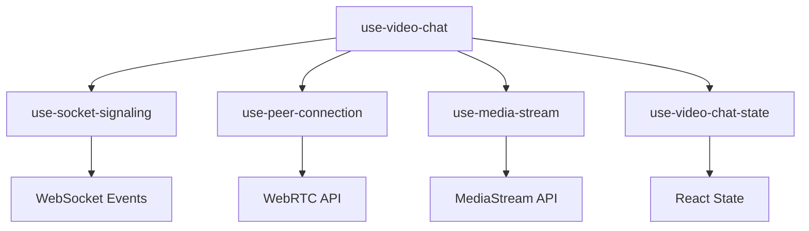
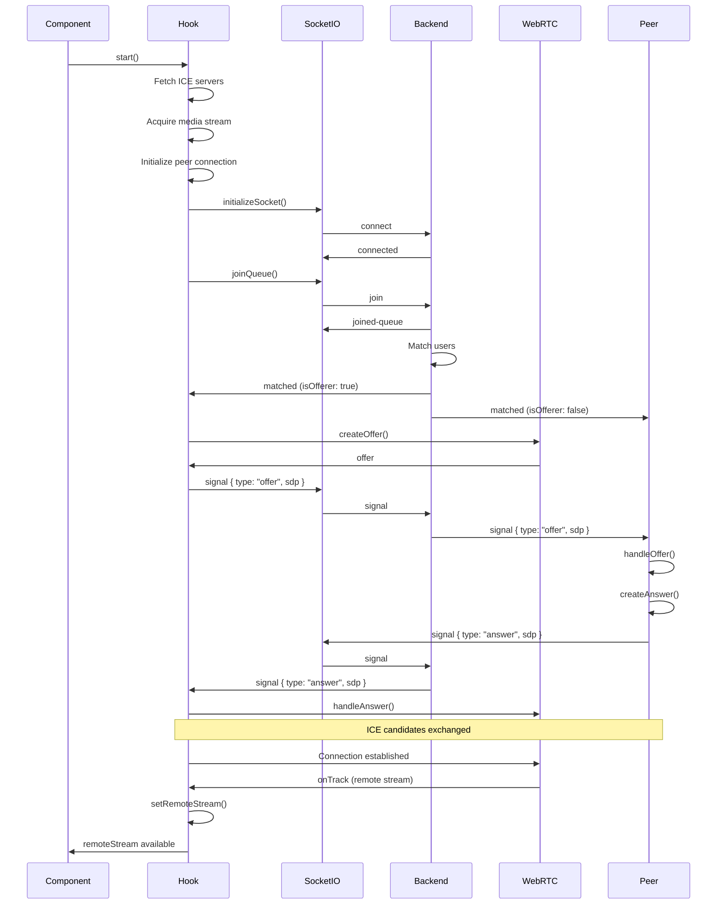
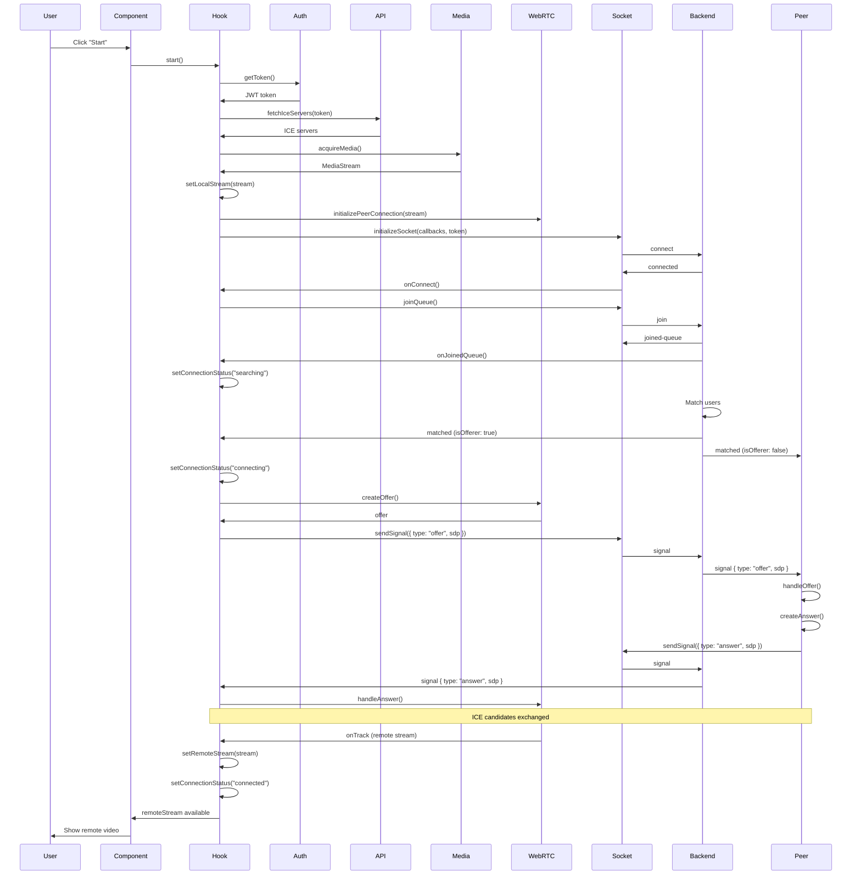

# use-video-chat

## Overview

`use-video-chat` is the main orchestrator hook that combines all video chat functionality. It integrates WebSocket signaling, WebRTC peer connections, media stream management, and state management into a single, easy-to-use interface.

## Purpose

This hook provides:
- Complete video chat functionality in one hook
- Automatic orchestration of all sub-hooks
- WebSocket connection management
- WebRTC peer connection handling
- Media stream management
- State management
- Error handling and recovery
- Authentication integration with Clerk

## Architecture

The hook composes multiple specialized hooks to provide a complete video chat solution:



### Core Structure

```typescript
export function useVideoChat(): UseVideoChatReturn {
  const { getToken, isLoaded } = useAuth();
  const { user } = useUser();
  
  const { state, actions } = useVideoChatState();
  const iceServersRef = useRef<RTCIceServer[]>([]);
  const actionsRef = useRef(actions);
  actionsRef.current = actions;
  
  const mediaStream = useMediaStream();
  const peerConnection = usePeerConnection(iceServersRef.current);
  const socketSignaling = useSocketSignaling();
  
  // ... implementation
}
```

### Key Components

1. **Authentication**: Clerk auth for token management
2. **State Management**: useVideoChatState for UI state
3. **Media Stream**: useMediaStream for camera/microphone
4. **Peer Connection**: usePeerConnection for WebRTC
5. **Socket Signaling**: useSocketSignaling for WebSocket communication
6. **ICE Servers**: Ref for STUN/TURN server configuration

## Backend Interaction

The hook interacts with the backend through:

1. **WebSocket (Socket.IO)**: All real-time communication
2. **REST API**: ICE server configuration
3. **MQTT**: Presence status (via use-socket-signaling)

### Complete Communication Flow



## Frontend Integration

### Basic Usage

```typescript
import { useVideoChat } from '@/hooks/use-video-chat';

function VideoChatComponent() {
  const {
    localStream,
    remoteStream,
    connectionStatus,
    isMuted,
    isVideoOff,
    remoteMuted,
    chatMessages,
    sendMessage,
    start,
    skip,
    endCall,
    toggleMute,
    toggleVideo,
    error,
    clearError,
  } = useVideoChat();
  
  return (
    <div>
      <video ref={localVideoRef} srcObject={localStream} />
      <video ref={remoteVideoRef} srcObject={remoteStream} />
      <button onClick={start}>Start</button>
      <button onClick={toggleMute}>Mute</button>
      <button onClick={endCall}>End Call</button>
    </div>
  );
}
```

## Key Functions

### `start()`

Initiates the video chat process.

**Returns:** Promise<void>

**Behavior:**
1. Validates authentication
2. Fetches ICE servers if not cached
3. Acquires media stream (camera + microphone)
4. Initializes peer connection
5. Initializes WebSocket connection
6. Joins matchmaking queue

**Code Flow:**
```typescript
async function start() {
  // 1. Validate auth
  if (!isLoaded) {
    actions.setError("Authentication not ready. Please wait...");
    return;
  }
  
  const token = await getToken({ template: 'custom', skipCache: true });
  if (!token) {
    actions.setError("Authentication required. Please sign in.");
    return;
  }
  
  // 2. Fetch ICE servers
  if (iceServersRef.current.length === 0) {
    iceServersRef.current = await fetchIceServers(token);
  }
  
  // 3. Acquire media
  const stream = await mediaStream.acquireMedia();
  actions.setLocalStream(stream);
  
  // 4. Initialize peer connection
  peerConnection.initializePeerConnection(stream, peerCallbacks);
  
  // 5. Initialize socket
  await socketSignaling.initializeSocket(socketCallbacks, token);
  
  // 6. Join queue
  socketSignaling.joinQueue();
}
```

**Error Handling:**
- Catches all errors
- Sets error state
- Cleans up resources
- Sets connection status to "idle"

### `skip()`

Skips current peer and re-enters matchmaking queue.

**Behavior:**
1. Closes peer connection
2. Clears remote stream
3. Clears chat messages
4. Resets remote mute state
5. Emits skip event to server

**Code Flow:**
```typescript
function skip() {
  peerConnection.closePeer();
  actions.setRemoteStream(null);
  actions.clearChatMessages();
  actions.setRemoteMuted(false);
  socketSignaling.skipPeer();
}
```

### `endCall()`

Ends the current call.

**Behavior:**
1. Emits end-call event to server
2. Resets peer state (streams, chat, etc.)
3. Shows toast notification

**Code Flow:**
```typescript
function endCall() {
  socketSignaling.sendEndCall();
  toast("Call ended - You have ended the call.");
  resetPeerState();
}
```

### `toggleMute()`

Toggles local audio mute state.

**Behavior:**
1. Toggles mute in media stream
2. Updates state
3. Notifies peer via WebSocket

**Code Flow:**
```typescript
function toggleMute() {
  const newMutedState = mediaStream.toggleMute();
  actions.setMuted(newMutedState);
  socketSignaling.sendMuteToggle(newMutedState);
}
```

### `toggleVideo()`

Toggles local video on/off state.

**Behavior:**
1. Toggles video in media stream
2. Updates state
3. No WebSocket notification (local only)

**Code Flow:**
```typescript
function toggleVideo() {
  const newVideoOffState = mediaStream.toggleVideo();
  actions.setVideoOff(newVideoOffState);
}
```

### `sendMessage(message)`

Sends a chat message to the peer.

**Parameters:**
- `message`: string

**Behavior:**
1. Validates message (non-empty)
2. Creates message object with metadata
3. Adds to local state (optimistic update)
4. Sends to peer via WebSocket

**Code Flow:**
```typescript
function sendMessage(message: string) {
  if (!message.trim()) return;
  
  const timestamp = Date.now();
  const socketId = socketSignaling.getSocketId();
  
  const newMessage: ChatMessage = {
    id: `${socketId}-${timestamp}`,
    message: message.trim(),
    timestamp,
    senderId: socketId || "unknown",
    senderName: user?.firstName || user?.username || "You",
    senderImageUrl: user?.imageUrl,
    isOwn: true,
  };
  
  actions.addChatMessage(newMessage);
  socketSignaling.sendChatMessage(message.trim(), timestamp);
}
```

### `clearError()`

Clears the current error message.

**Code Flow:**
```typescript
function clearError() {
  actions.setError(null);
}
```

## Complete Flow Diagram

### Start to Connected Flow



## Socket Callbacks

The hook provides comprehensive callbacks for all WebSocket events:

### Connection Events

```typescript
onConnect: () => {},
onDisconnect: () => {
  actions.setConnectionStatus("peer-disconnected");
},
onConnectError: () => {
  actions.setError("Failed to connect to server. Please refresh the page.");
  toast.error("Failed to connect. Please refresh the page.");
},
```

### Matchmaking Events

```typescript
onJoinedQueue: (data) => {
  actions.setConnectionStatus("searching");
},
onMatched: async (data) => {
  actions.setConnectionStatus("connecting");
  toast.success("Peer matched! Connecting to peer...");
  
  const localStream = mediaStream.getStream();
  peerConnection.initializePeerConnection(localStream, peerCallbacks);
  
  if (data.isOfferer) {
    const offer = await peerConnection.createOffer();
    socketSignaling.sendSignal({ type: "offer", sdp: offer });
  }
},
```

### Signaling Events

```typescript
onSignal: async (data) => {
  if (!peerConnection.isConnectionValid()) return;
  
  if (data.type === "offer") {
    const answer = await peerConnection.handleOffer(data.sdp);
    socketSignaling.sendSignal({ type: "answer", sdp: answer });
  } else if (data.type === "answer") {
    await peerConnection.handleAnswer(data.sdp);
  } else if (data.type === "ice-candidate") {
    await peerConnection.addIceCandidate(data.candidate);
  }
},
```

### Peer Events

```typescript
onPeerLeft: (data) => {
  peerConnection.closePeer();
  actions.setRemoteStream(null);
  actions.clearChatMessages();
  actions.setRemoteMuted(false);
  
  if (data.queueSize !== undefined) {
    actions.setConnectionStatus("searching");
    toast(`Peer disconnected - ${data.message}`);
  } else {
    actions.setConnectionStatus("peer-disconnected");
    toast.error(`Peer disconnected - ${data.message}`);
  }
},
onPeerSkipped: (data) => {
  peerConnection.closePeer();
  actions.setConnectionStatus("searching");
  actions.setRemoteStream(null);
  actions.clearChatMessages();
  actions.setRemoteMuted(false);
  toast(`Peer skipped - ${data.message}`);
},
```

### Chat Events

```typescript
onChatMessage: (data) => {
  const socketId = socketSignaling.getSocketId();
  const newMessage: ChatMessage = {
    id: `${data.senderId}-${data.timestamp}`,
    message: data.message,
    timestamp: data.timestamp,
    senderId: data.senderId,
    senderName: data.senderName,
    senderImageUrl: data.senderImageUrl,
    isOwn: data.senderId === socketId,
  };
  actions.addChatMessage(newMessage);
},
```

### Other Events

```typescript
onMuteToggle: (data) => {
  actions.setRemoteMuted(data.muted);
},
onEndCall: (data) => {
  toast(`Call ended - ${data.message}`);
  resetPeerState();
},
onQueueTimeout: (data) => {
  actions.setError(data.message);
  actions.setConnectionStatus("idle");
  toast.error(`Queue timeout - ${data.message}`);
},
onError: (data) => {
  actions.setError(data.message);
  toast.error(`Error - ${data.message}`);
},
```

## Peer Connection Callbacks

The hook provides callbacks for WebRTC events:

```typescript
const peerCallbacks = {
  onTrack: (stream) => {
    actions.setRemoteStream(stream);
    actions.setConnectionStatus("connected");
    toast.success("You are now connected with your peer.");
  },
  onIceCandidate: (candidate) => {
    socketSignaling.sendSignal({
      type: "ice-candidate",
      candidate: candidate.toJSON(),
    });
  },
  onConnectionStateChange: (connectionState) => {
    if (connectionState === "disconnected" || connectionState === "failed") {
      actions.setConnectionStatus("peer-disconnected");
    } else if (connectionState === "connected") {
      actions.setConnectionStatus("connected");
    }
  },
  onIceConnectionStateChange: (iceConnectionState) => {
    if (iceConnectionState === "failed" || iceConnectionState === "disconnected") {
      actions.setConnectionStatus("peer-disconnected");
    }
  },
};
```

## Initialization Flow

### ICE Server Fetching

ICE servers are fetched on mount and cached:

```typescript
useEffect(() => {
  async function initIceServers() {
    if (!isLoaded) return;
    
    const token = await getToken({ template: 'custom', skipCache: true });
    if (!token) throw new Error("No token found");
    
    const servers = await fetchIceServers(token);
    iceServersRef.current = servers;
  }
  
  initIceServers();
}, [isLoaded]);
```

### Token Refresh

Tokens are refreshed every 5 minutes:

```typescript
useEffect(() => {
  const updateToken = async () => {
    const token = await getToken({ template: 'custom', skipCache: true });
    if (token) {
      socketSignaling.updateSocketToken(token);
    }
  };
  
  updateToken();
  const interval = setInterval(updateToken, 300_000); // 5 minutes
  
  return () => clearInterval(interval);
}, [isLoaded, getToken, socketSignaling]);
```

## Cleanup

The hook automatically cleans up on unmount:

```typescript
useEffect(() => {
  return () => {
    cleanup();
  };
}, [cleanup]);

function cleanup() {
  resetPeerState();
  socketSignaling.disconnectSocket();
}

function resetPeerState() {
  mediaStream.releaseMedia();
  peerConnection.closePeer();
  actions.resetPeerState();
  actions.setLocalStream(null);
}
```

## Return Value

```typescript
interface UseVideoChatReturn {
  localStream: MediaStream | null;
  remoteStream: MediaStream | null;
  connectionStatus: ConnectionStatus;
  isMuted: boolean;
  isVideoOff: boolean;
  remoteMuted: boolean;
  chatMessages: ChatMessage[];
  sendMessage: (message: string) => void;
  start: () => Promise<void>;
  skip: () => void;
  endCall: () => void;
  toggleMute: () => void;
  toggleVideo: () => void;
  error: string | null;
  clearError: () => void;
}
```

## State Properties

All state is managed by `use-video-chat-state` and exposed through the hook:

| Property | Type | Description |
|----------|------|-------------|
| `localStream` | `MediaStream \| null` | User's camera/microphone stream |
| `remoteStream` | `MediaStream \| null` | Peer's video/audio stream |
| `connectionStatus` | `ConnectionStatus` | Current connection status |
| `isMuted` | `boolean` | Local audio mute state |
| `isVideoOff` | `boolean` | Local video off state |
| `remoteMuted` | `boolean` | Remote peer mute state |
| `chatMessages` | `ChatMessage[]` | Array of chat messages |
| `error` | `string \| null` | Current error message |

## Error Handling

### Authentication Errors

```typescript
if (!isLoaded) {
  actions.setError("Authentication not ready. Please wait...");
  return;
}

const token = await getToken({ template: 'custom', skipCache: true });
if (!token) {
  actions.setError("Authentication required. Please sign in.");
  return;
}
```

### ICE Server Errors

```typescript
try {
  const servers = await fetchIceServers(token);
  iceServersRef.current = servers;
} catch (err) {
  actions.setError("Failed to initialize connection. Please refresh the page.");
}
```

### Media Acquisition Errors

```typescript
try {
  const stream = await mediaStream.acquireMedia();
} catch (err) {
  actions.setError(err instanceof Error ? err.message : "Failed to start video chat");
  cleanup();
}
```

### WebRTC Errors

```typescript
try {
  const offer = await peerConnection.createOffer();
} catch (err) {
  actions.setError("Failed to establish connection. Please try again.");
  actions.setConnectionStatus("peer-disconnected");
}
```

### Signal Processing Errors

```typescript
try {
  if (data.type === "offer") {
    const answer = await peerConnection.handleOffer(data.sdp);
  }
} catch (err) {
  if (peerConnection.isConnectionValid()) {
    actions.setError("Failed to process connection signal. Please try again.");
  }
}
```

## Dependencies

- `@clerk/nextjs`: Authentication (`useAuth`, `useUser`)
- `@/hooks/use-socket-signaling`: WebSocket communication
- `@/hooks/use-peer-connection`: WebRTC peer connection
- `@/hooks/use-media-stream`: Media stream management
- `@/hooks/use-video-chat-state`: State management
- `@/lib/webrtc`: ICE server fetching
- `react-hot-toast`: Toast notifications
- `@/utils/logger`: Logging utilities

## Best Practices

1. **Single Instance**: Use one instance per component
2. **Cleanup**: Let the hook handle cleanup automatically
3. **Error Handling**: Always check `error` state and display to user
4. **Status Monitoring**: Monitor `connectionStatus` for UI updates
5. **Resource Management**: Don't manually manage streams/connections

## Common Patterns

### Complete Video Chat Component

```typescript
function VideoChatComponent() {
  const {
    localStream,
    remoteStream,
    connectionStatus,
    isMuted,
    isVideoOff,
    chatMessages,
    sendMessage,
    start,
    skip,
    endCall,
    toggleMute,
    toggleVideo,
    error,
    clearError,
  } = useVideoChat();
  
  const localVideoRef = useRef<HTMLVideoElement>(null);
  const remoteVideoRef = useRef<HTMLVideoElement>(null);
  
  useEffect(() => {
    if (localVideoRef.current && localStream) {
      localVideoRef.current.srcObject = localStream;
    }
  }, [localStream]);
  
  useEffect(() => {
    if (remoteVideoRef.current && remoteStream) {
      remoteVideoRef.current.srcObject = remoteStream;
    }
  }, [remoteStream]);
  
  return (
    <div>
      {error && (
        <div className="error">
          {error}
          <button onClick={clearError}>Dismiss</button>
        </div>
      )}
      
      <div className="videos">
        <video ref={localVideoRef} muted autoPlay />
        <video ref={remoteVideoRef} autoPlay />
      </div>
      
      <div className="controls">
        <button onClick={start} disabled={connectionStatus !== "idle"}>
          Start
        </button>
        <button onClick={toggleMute}>
          {isMuted ? "Unmute" : "Mute"}
        </button>
        <button onClick={toggleVideo}>
          {isVideoOff ? "Turn On Video" : "Turn Off Video"}
        </button>
        <button onClick={skip} disabled={connectionStatus !== "connected"}>
          Skip
        </button>
        <button onClick={endCall} disabled={connectionStatus !== "connected"}>
          End Call
        </button>
      </div>
      
      <div className="status">
        Status: {getConnectionStatusMessage(connectionStatus)}
      </div>
      
      <div className="chat">
        {chatMessages.map((msg) => (
          <div key={msg.id} className={msg.isOwn ? "own" : "peer"}>
            {msg.message}
          </div>
        ))}
        <input
          onKeyPress={(e) => {
            if (e.key === "Enter") {
              sendMessage(e.currentTarget.value);
              e.currentTarget.value = "";
            }
          }}
        />
      </div>
    </div>
  );
}
```

## Troubleshooting

### Connection Not Starting

1. Check authentication (Clerk token)
2. Verify ICE servers are fetched
3. Check media permissions
4. Verify WebSocket connection
5. Check browser console for errors

### Peer Not Connecting

1. Verify offer/answer exchange
2. Check ICE candidate exchange
3. Monitor connection state changes
4. Check firewall/NAT configuration
5. Verify STUN/TURN servers

### Media Not Showing

1. Verify streams are set in state
2. Check video element srcObject
3. Verify tracks are enabled
4. Check browser permissions

### Chat Not Working

1. Verify WebSocket connection
2. Check message format
3. Verify peer is in same room
4. Check backend logs
