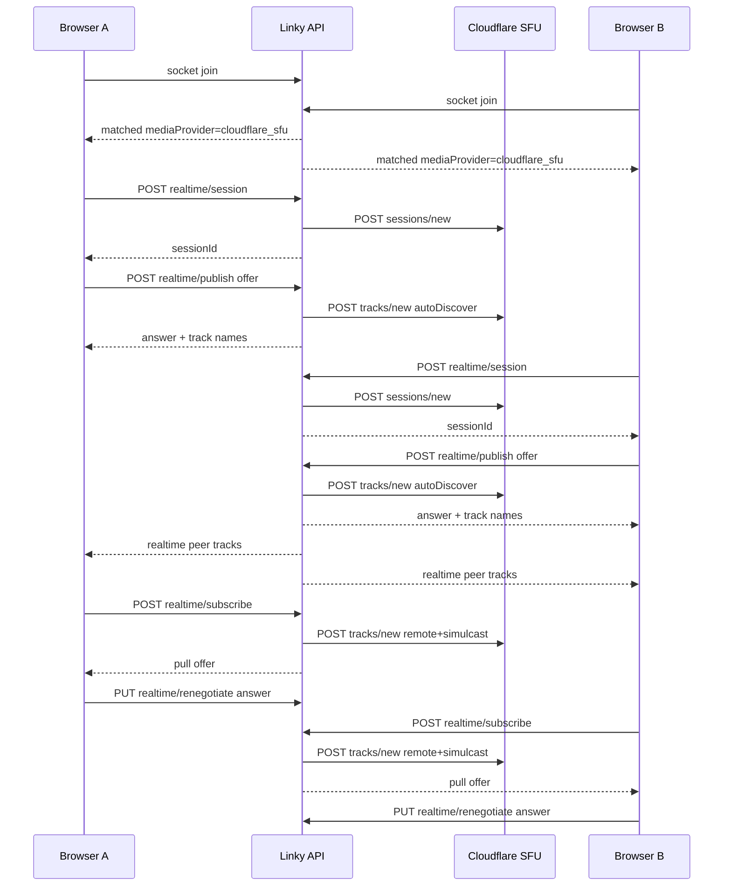

# Cloudflare Realtime SFU migration

This document describes the migration from a peer-to-peer WebRTC topology
(Cloudflare TURN as relay) to Cloudflare Realtime SFU as the active media
transport for Linky 1-on-1 calls. The migration is gated behind a feature
flag (`VIDEO_PROVIDER`) so the original P2P path remains the default and is
fully usable for rollback.

## Summary

| Aspect | Old (P2P) | New (Cloudflare SFU) |
| --- | --- | --- |
| Topology | Browser-to-browser via STUN/TURN | Browser ↔ Cloudflare SFU per side |
| Linky API role | Signaling relay (offer/answer/ICE), TURN credential issuer | Plus Cloudflare HTTPS API broker (sessions/tracks) |
| ICE | Cloudflare TURN credentials per session | `stun.cloudflare.com:3478` (no TURN required) |
| Recovery | ICE-restart tiers via `recoveryController` | Reconnect via socket resync + new SFU session |
| Simulcast | None | f / h / q layers; SFU pulls preferred RID |
| Adaptive quality | Custom `QualityController` | Simulcast at SFU + existing client capture caps |

## Old architecture summary

- Frontend orchestrator: [`apps/web/src/features/video-chat/hooks/webrtc/use-video-chat.ts`](../apps/web/src/features/video-chat/hooks/webrtc/use-video-chat.ts)
  composes `useMediaStream`, `usePeerConnection`, and `useSocketSignaling`.
- Backend matchmaking emits `matched` to both sockets; the lower `socketId`
  becomes the offerer.
- Both browsers create their own `RTCPeerConnection` and exchange
  `offer` / `answer` / `ice-candidate` over the `/chat` Socket.IO namespace,
  validated server-side in [`setup-signal.handler.ts`](../apps/api/src/domains/video-chat/socket/setup-handlers/setup-signal.handler.ts).
- ICE servers come from `GET /api/ice-servers`, which calls Cloudflare's
  TURN credentials endpoint with `CLOUDFLARE_TURN_API_TOKEN` /
  `CLOUDFLARE_TURN_KEY_ID`.

## New architecture summary

- A new feature flag `VIDEO_PROVIDER` (`p2p` | `cloudflare_sfu`) on the API
  controls the transport.
- `matched` events now include `mediaProvider`. When `cloudflare_sfu` is set:
  1. The API still owns matchmaking and room state.
  2. The browser asks the API to provision a Cloudflare Realtime session
     (`POST /api/v1/video-chat/realtime/session`) and stores the returned
     `sessionId`.
  3. The browser opens a single `RTCPeerConnection` to Cloudflare SFU using
     `stun.cloudflare.com:3478`.
  4. Local audio/video transceivers are added with simulcast
     `sendEncodings: [{ rid: "f" }, { rid: "h" }, { rid: "q" }]`.
  5. The browser POSTs the offer SDP to
     `POST /api/v1/video-chat/realtime/publish`. The API forwards to Cloudflare
     `/sessions/{id}/tracks/new` with `autoDiscover: true` and returns the
     answer plus published track names. The API stores those track names on
     the `VideoChatRoomRecord.realtime` slice.
  6. When both peers have published, the API emits `realtime:peer-tracks` to
     each side with `{ peerSessionId, tracks }`.
  7. Each browser POSTs to `POST /api/v1/video-chat/realtime/subscribe`. The
     API issues a Cloudflare pull request that includes the peer's
     `sessionId` and track names plus a `simulcast` preference for video.
     Cloudflare answers with an offer; the browser computes an answer and
     calls `PUT /api/v1/video-chat/realtime/renegotiate` to commit it.
  8. App-level events (skip, end-call, mute, video toggle, chat, screen
     share metadata, favorites, reports) continue to use existing Socket.IO
     events. Cloudflare DataChannels are not used for app signaling.
- Cleanup on skip/end/disconnect removes the participant from
  `room.realtime.participants` and best-effort closes the published mids
  via `tracks/close`.



## Required environment variables

| Variable | Purpose | When required |
| --- | --- | --- |
| `VIDEO_PROVIDER` | `p2p` (default) or `cloudflare_sfu` | Always |
| `CLOUDFLARE_REALTIME_APP_ID` | Cloudflare Realtime App ID | When `VIDEO_PROVIDER=cloudflare_sfu` |
| `CLOUDFLARE_REALTIME_APP_SECRET` | Cloudflare Realtime App Secret (Bearer token) | When `VIDEO_PROVIDER=cloudflare_sfu` |
| `CLOUDFLARE_REALTIME_BASE_URL` | Override SFU base URL (default `https://rtc.live.cloudflare.com/v1`) | Optional |
| `CLOUDFLARE_ACCOUNT_ID` | For dashboard scripts/tooling only | Optional |
| `CLOUDFLARE_TURN_API_TOKEN`, `CLOUDFLARE_TURN_KEY_ID` | Existing TURN credentials | Used in `p2p` mode and as fallback |

The App ID and Secret come from the Cloudflare dashboard under
**Realtime → Apps → Create**. Treat the App Secret like any other
credential: it must remain server-side. Cloudflare Realtime usage shares a
combined 1,000 GB/month free tier across SFU and TURN; only edge-to-client
traffic is billed.

## Local testing

1. Set in `.env`:
   ```env
   VIDEO_PROVIDER=cloudflare_sfu
   CLOUDFLARE_REALTIME_APP_ID=<from dash>
   CLOUDFLARE_REALTIME_APP_SECRET=<from dash>
   ```
2. Boot services: `pnpm dev:api` and `pnpm dev:web` (Redis is required).
3. Open two browsers (or one normal + one private window) on
   `http://localhost:3000/call`. Sign in with two different Clerk accounts.
4. Click **Start** in each tab and grant camera/microphone permission.
5. Verify:
   - Local previews show on both sides.
   - Remote video appears in both tabs once they match.
   - Mute mic / disable camera reflects on the other side.
   - **Skip** in either tab tears down the call and re-enters the queue.
   - **End** in either tab terminates and cleans up.
6. Reload one tab mid-call. The other side should receive `peer-left` and
   the page reload should not leave any ghost room (visible in the API logs
   as `Room deleted`).
7. Inspect the production web bundle (`pnpm build:web`) and confirm no
   Cloudflare secret strings are present.

## Production deployment notes

- Set `VIDEO_PROVIDER=cloudflare_sfu` and the two Cloudflare Realtime
  variables on the API process. The web app needs no new envs.
- Free tier (1,000 GB/month combined SFU+TURN) is plenty for early users;
  monitor usage in the Cloudflare dash under **Realtime**.
- The API in-memory rooms map is unchanged; if you horizontally scale the
  API later, an in-cluster room store is required. This is unrelated to
  the SFU migration.
- Workers and queue contracts are untouched.

## Known limitations

- **Screen share** is currently disabled in SFU mode. The existing
  `replaceVideoTrack` flow does not match the SFU publish/subscribe model;
  re-enabling it requires a new "publish secondary video" flow with a
  renegotiate.
- **Recovery in SFU mode** is intentionally simple: on `failed` /
  `disconnected` for more than a few seconds, the client transitions to
  `reconnecting` and asks the socket layer to resync. The fine-grained
  ICE-restart tiers from `recoveryController` are P2P only.
- **Tab coordination, unload beacon, chat, presence, reports, favorites,
  reactions** are unchanged.
- **DataChannels** are not used for app signaling. Cloudflare SFU
  DataChannels can be one-way and would not replace bidirectional Socket.IO
  events without additional work.
- **`isOfferer`** is still emitted in `matched` for backwards compatibility
  but is ignored by the SFU client.
- **Multi-instance API**: the room state lives in process memory. This was
  already true before this migration; no change.

## Rollback plan

To roll back to P2P, set `VIDEO_PROVIDER=p2p` (or unset) on the API and
restart. The frontend automatically takes the original
`usePeerConnection` path because `matched.mediaProvider` becomes `p2p`.
The Cloudflare Realtime envs do not need to be removed; they are simply
unused in P2P mode.
